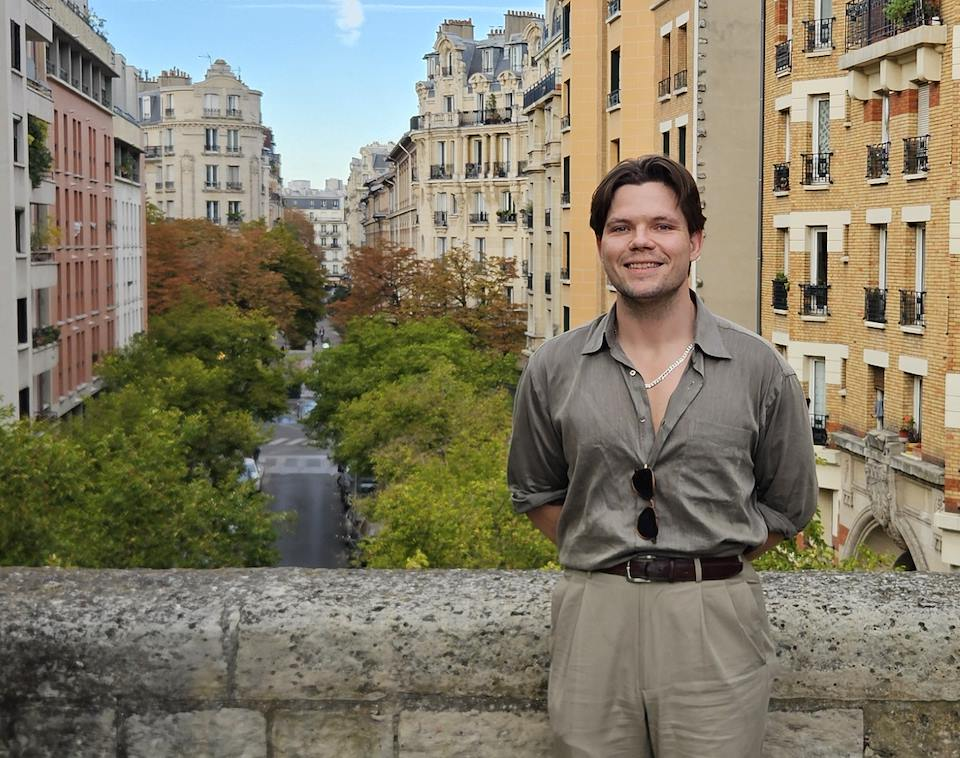
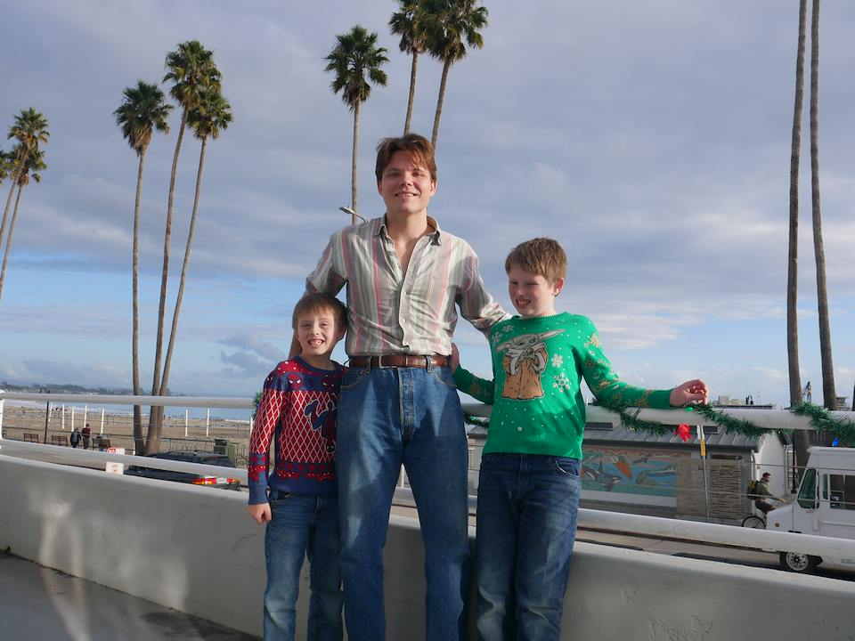
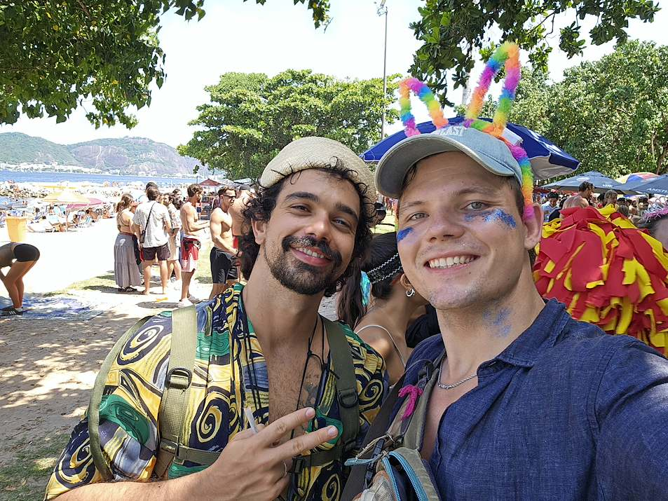
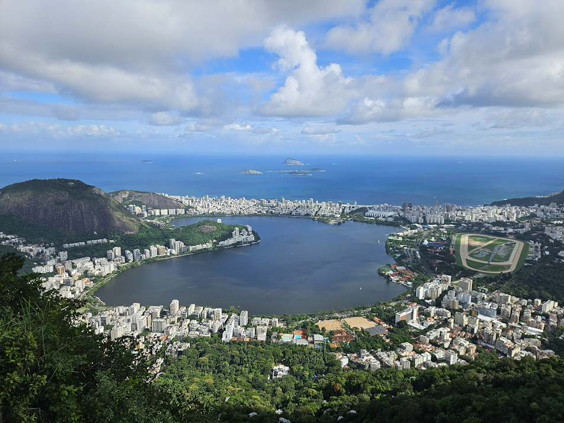
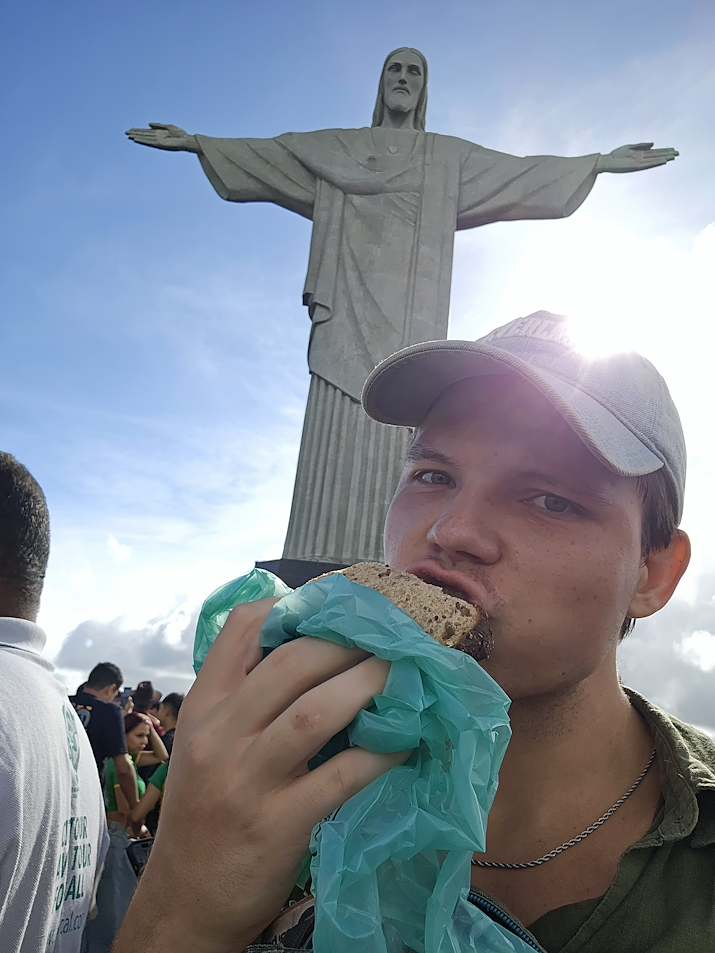
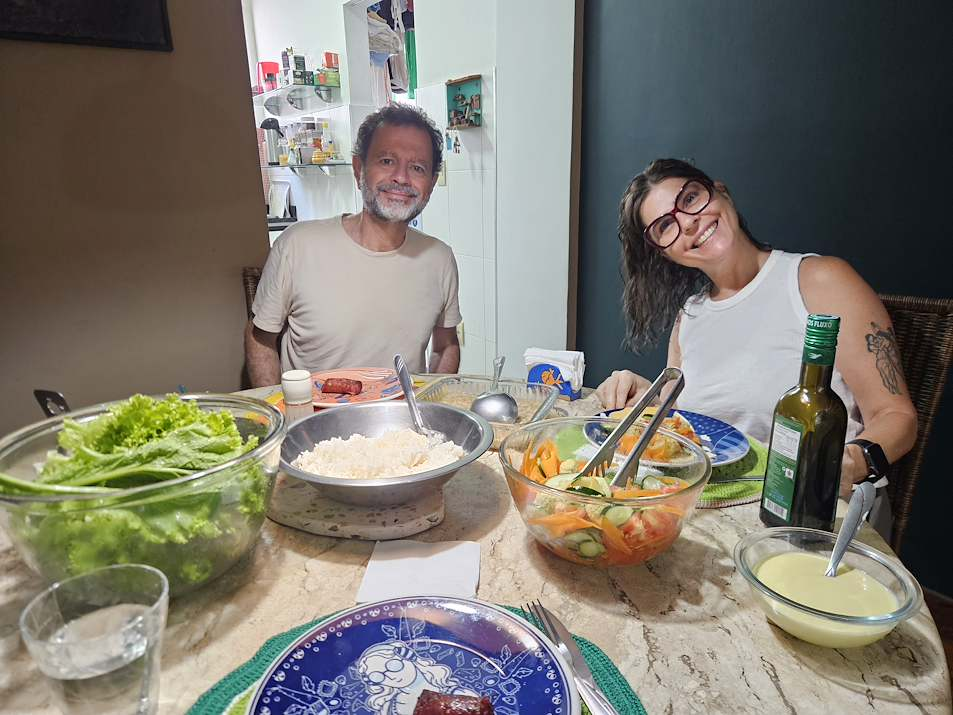
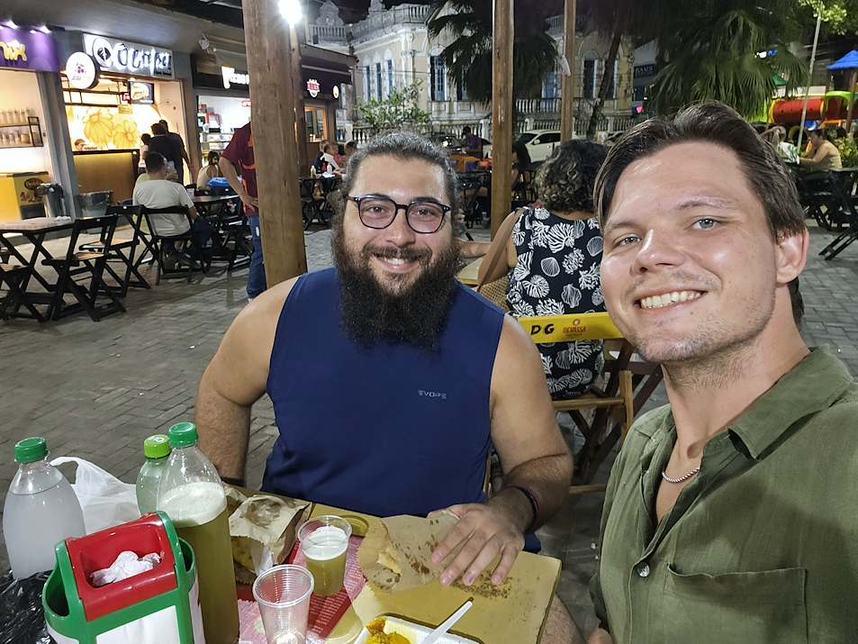
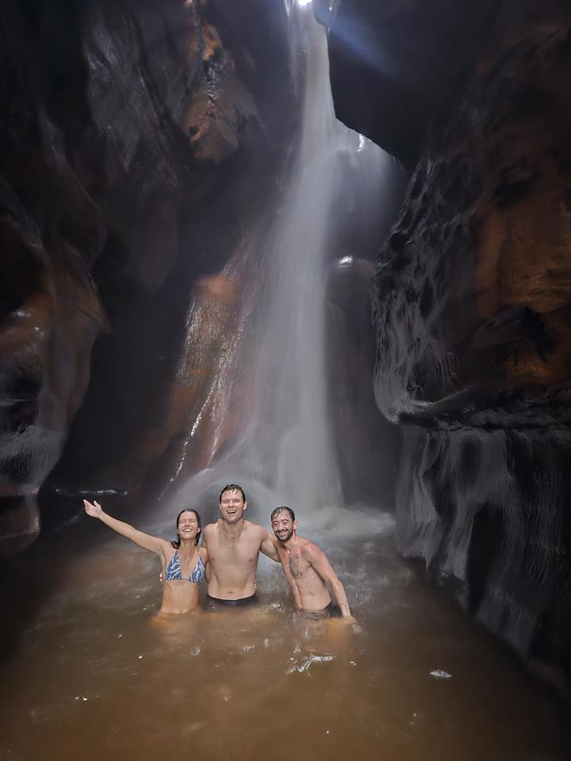
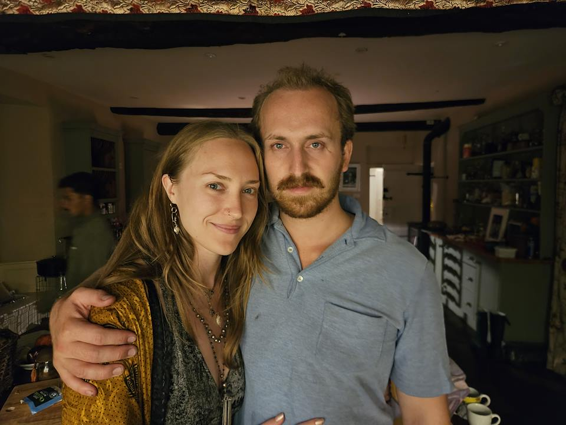

I really do not like the time around my birthday. Every year it looms over as a reminder of my age, the passing of time, and a judgemental referendum on all my life choices. 29 and no x, y, or z? Failure; 30 is around the corner; You're out of time to do all you want to do and be the person you want to be. Then the day comes and I get a rush of love and support from family and all the friends I've made along the way; I reflect on what I've done over the past year and realize that actually, I've made great choices and am living an amazing life of which I can be proud.

I started 28 living on my buddy's couch in the bay area. I had recently returned from two years in the Peace Corps and one year solo traveling. I had come off a high that felt like a rich fever dream to look upon. Memories from this time continue to spread my smile from ear to ear. Now I was unemployed and unable to find a job in my field, largely due to recent funding cuts since the recent change in administration. I was caught in a torment to choose my next step. Should I trade my idealist career aspirations for something more practical, like going to law school or even trade school? Should I throw practicality to the wind and become a film maker, writer, or worse, a short form content creator?

Through these struggles to find myself and my role in the world, I had one thing continually ringing in my heart: Brazil. I first became interested in the country in college. My favorite professor of political development focused his studies on Brazil; because I took many of his classes, I learned bounds about Brazil. When I went to the Peace Corps, I was sent to go to a lusophone country: Timor-Leste. While Portuguese isn't commonly spoken in Timor, I was able to learn it in my free time and practice with the speakers I could find. Being the largest lusophone country, most of the portuguese language content I consumed came from Brazil; this was the dry grass onto which my early spark of interest set ablaze.

Despite my deep interest in Brazil, I had never gone. Amongst that torment to choose my next move, I decided that while I still unrooted and before I settle down into anything, I would follow my passion and spend a few months in Brazil to consume, understand, and appreciate all that I could of this incredibly fascinating place. In January I was to go to a wedding in Mexico; I decided that from there I would not immediately come back to the US, but take one more long tour abroad. 

It was very stressful to put off a little longer getting a career, but in my heart I knew it was the right thing to do. From the wedding in Merida, Mexico, I spent a week in CDMX where I met up with friends from previous travels. Then I had a weeklong layover in Panama before finally arriving in Brazil, where I spent three months. In each of these places I did the things that I love most. I learned about places and peoples from meeting and connecting with them. I went out into the world with a open heart; my open heart was then filled beyond the brim with joy, knowledge, understanding, and love.

After that adventure, I came back to the US to travel slowly across the country by rail. Despite my extensive travels abroad, I had seen so little of my own country. I was able to stop in many places and see friends everywhere. I finally ended up on the east coast, in New York City, where I live now. 28 started in despair, but now I have stories from the adventures of this year that could fill novels. Rather than tell those stories, today I would only like to focus on the bold choice I made to go back out into the world and experience life in the most free, raw, and intimate way. When I finish posting this article, I will continue to work on grad school applications, where I hope to continue studying my passion: international development and public policy. This is another choice of the passion over the practical. It is a choice that I am always happy to make and one to which I am now ready commit.

This year started with going to the wedding of Nick and Ashley in Mexico and it ended with going to the wedding of Osy and Abby in England. At the latter, I met incredible people who inspire me. Amongst the talk of everyone's projects and aspirations, Osy shows me the quote on his phone lock screen: Defeat does not stop me, success does not satisfy me, I desire more. This is the energy in which I leave 28 and enter 29.

Thanks,

                    - Your friend Will

[Tell me what you think](mailto:dubjongeward@gmail.com)