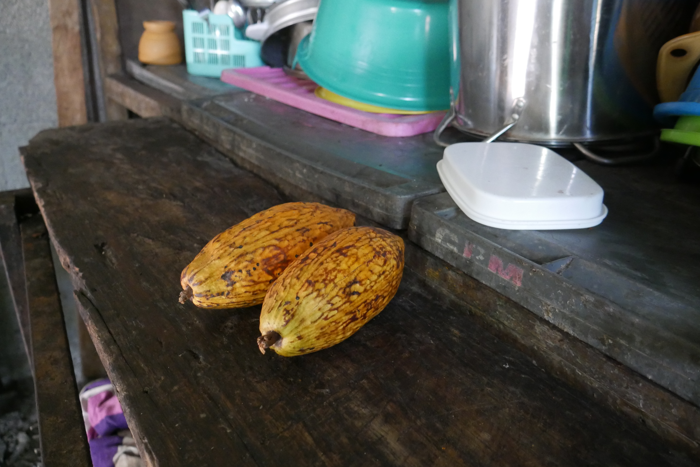
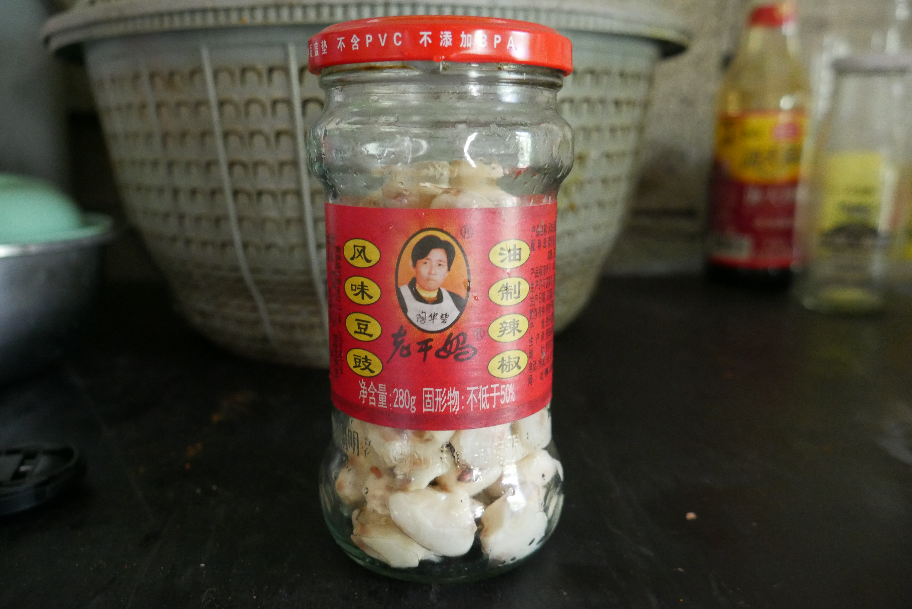
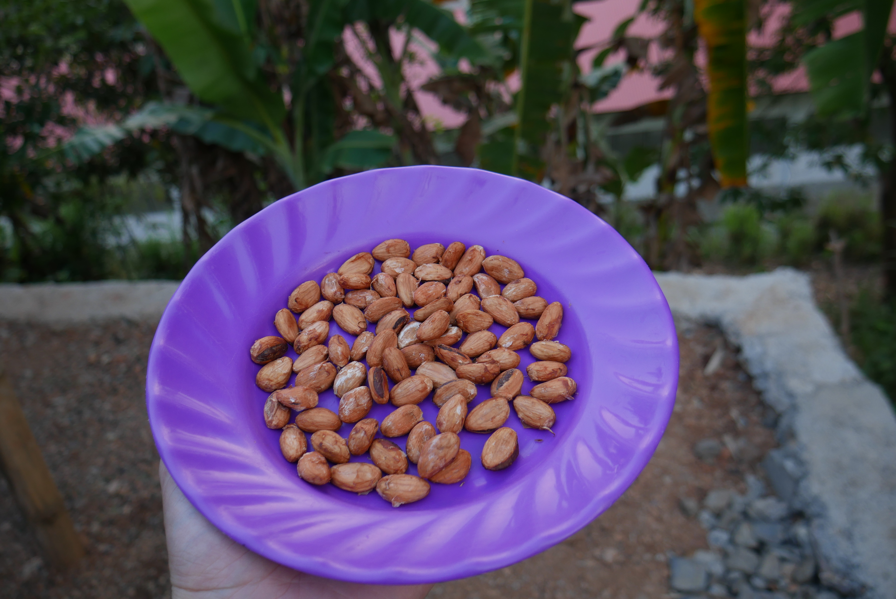
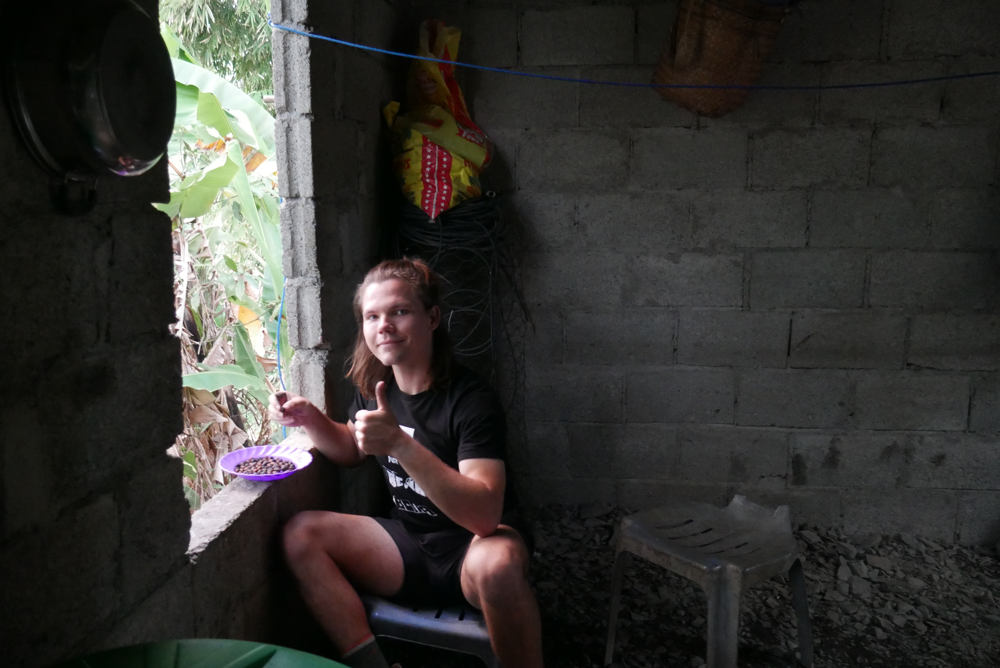

Though originally from the Americas, cacao grows well in Timor-Leste. It can be found growing naturally in the forests. I have only seen two companies grow and sell chocolate in Timor; highly processed, cheap, and imported chocolate products are common in the local diet, but not the simple locally grown stuff. In my village of Ermera, it is much more common to eat the scant white fruit around the cacao pod, then spit out the seeds, where the actual cacao is held. 

When a group of boys first showed me the cacao pods they found, I thought it was extremely cool. I asked around why people don't make chocolate since it grows so well here. The people just didn't know how to make it. I took the task upon myself to learn how to make chocolate then teach my village so maybe they could earn extra income or simply enjoy chocolate for themselves. 

Through a few hours of research, I learned how to process cacao into chocolate and found a workflow that would work for my scale. In doing this, I realized that the process was very similar to making coffee, the main economic force of my village; I hoped this similarity would mean that cacao could take off as a supplement to the coffee economy. The process to turn cacao to chocolate is 

1 - Open the ripe pod to reveal the flesh covered seeds

2 - Ferment the seeds either aerobically or anaerobically. I chose to ferment in a jar in the sun, opening it once a day for a week. Do this until the white flesh goes away and all is left are light brown seeds.

3 - Leave the seeds in the sun to dry. Should only take a few hours

4 - Roast the seeds until they are dark brown

5 - After cool, peel the skins to reveal the glossy semi-final product

For my tastes, this is where I ended the project. I love the complex and bitter flavors of cacao. This is most similar to "cacao nibs" one can find in any fancy health store. To process into chocolate, one would need to grind into a paste and optionally add sugar or milk powder. There are other processes like "Dutch Processing" that would further change the product. 

I showed this to my family, with the assumption that they would then do it themselves with the cacao they found in the forest. They never did. At first, I felt bummed that my idea didn't take off, but later I realized that there are countless reasons why it didn't. It takes more than a demonstration to start a new industry in a village. It also probably didn't help that they thought my finished product was disgusting and very different than the cheap, highly processed, and imported chocolate products they were familiar with. What I thought would be a lesson for them, was much more of a lesson for me.

 

On the bright side, this mostly meant more face-puckering bitter cacao for me.

