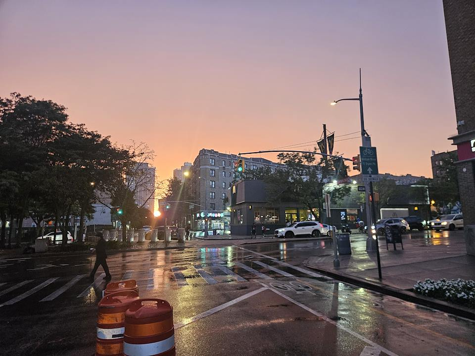
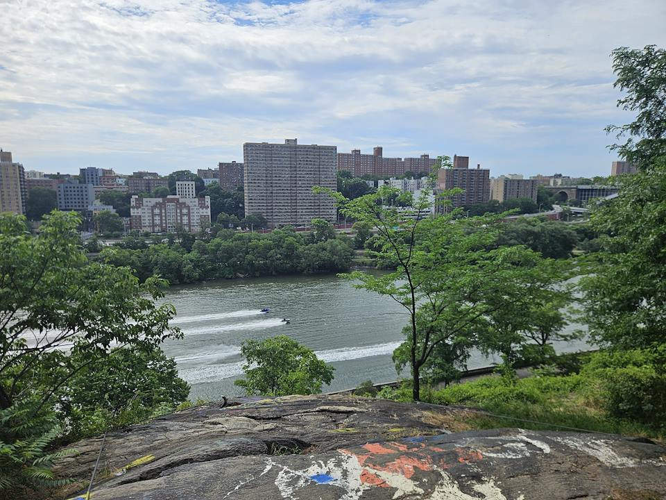
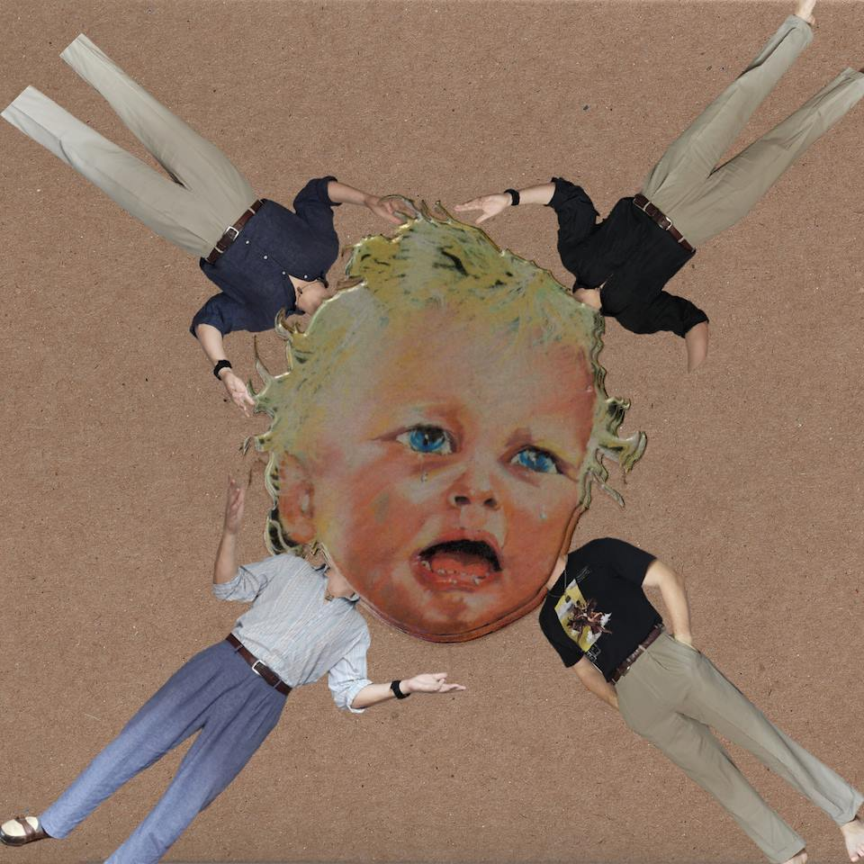
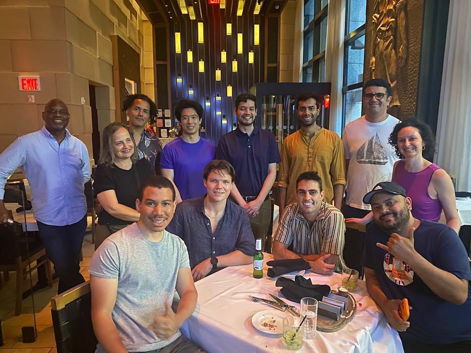
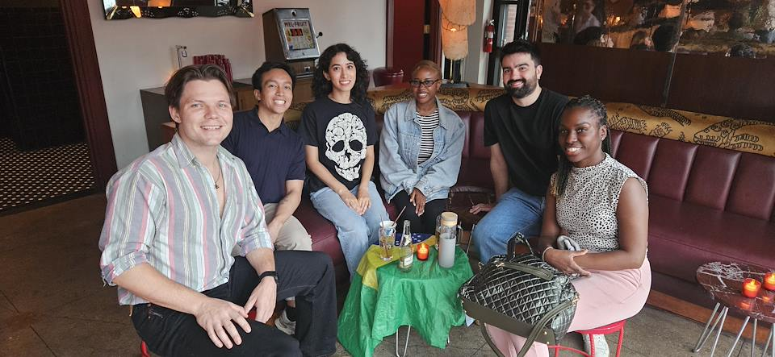
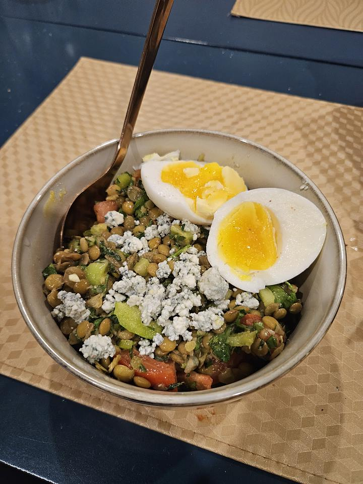
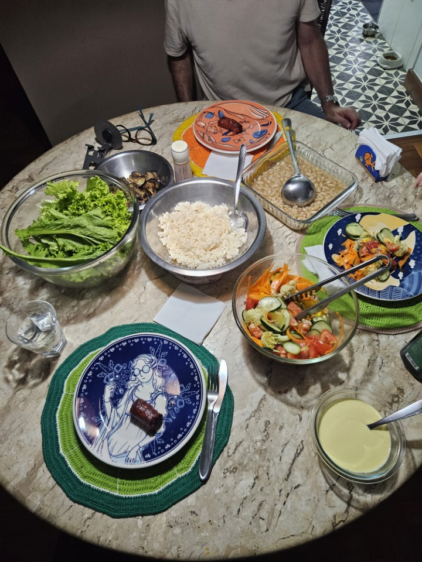
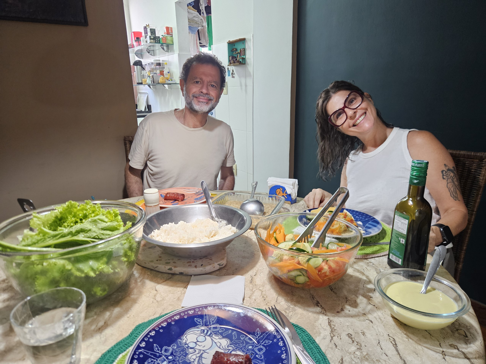
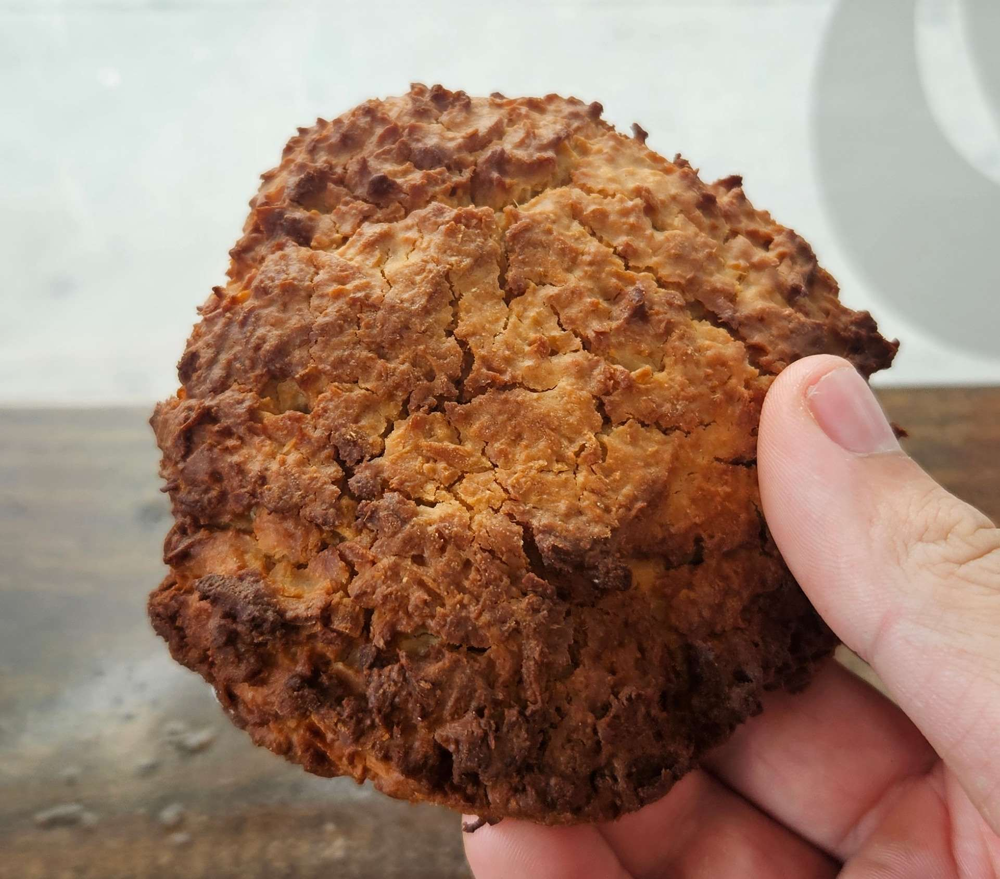
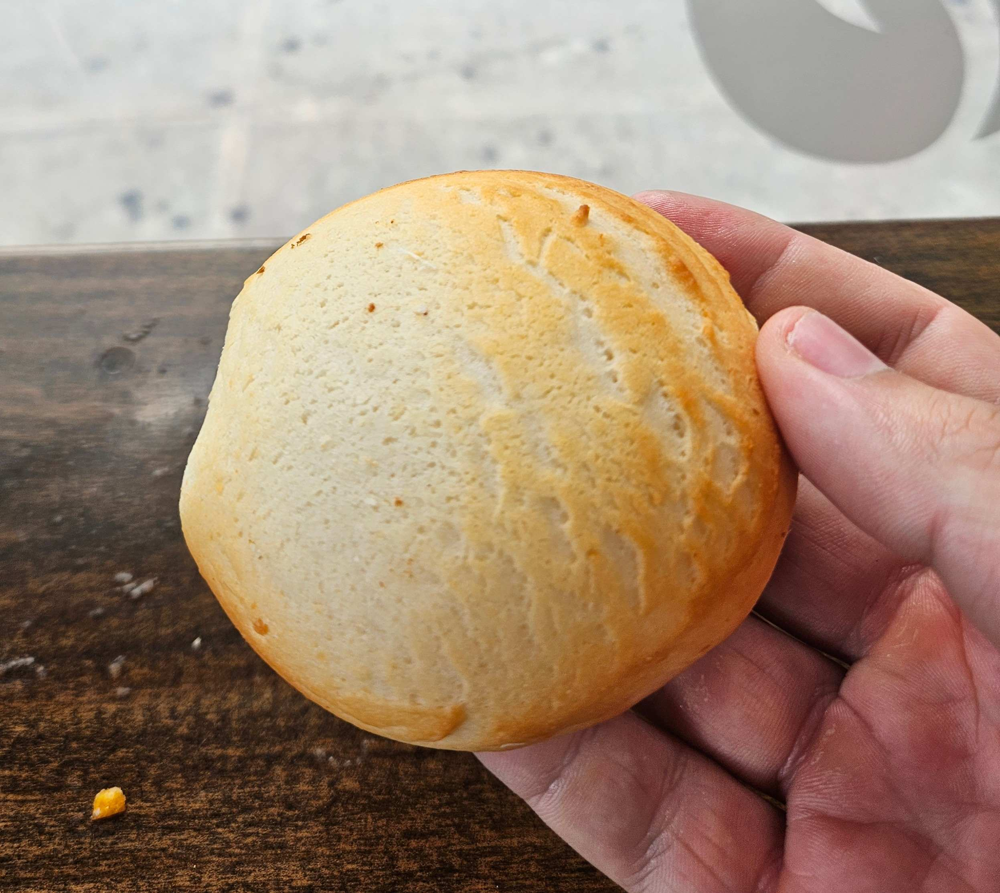

## What I've been doing

I made this website. It has been a fun project. The main goal was to create a space where I could share my thoughts, photos, and updates outside of social media. The secondary goal was to learn how to make a website rather than pay for a website maker like Squarespace, as I was doing briefly when I was in the Peace Corps. It has been a success on both goals; I now have a very customizable website whose format and workflow I like very much in order to share my stuff and I feel increasingly empowered to continue to learn things like html, css, and python (all things that felt impossible for me, a man of mostly brute and occasionally letters but never computer science, to learn). I will save why I think moving away from social media is important for another post.

I moved to New York City in April, but it wasn't until July that I finally started to find my groove. After two years in the Peace Corps and one year traveling, there have been challenges in resettling and starting to live somewhere again, especially in a new city. Fortunately I moved in with Isaac, a friend from college. Every week I make an hour long trek to Brooklyn to play soccer with Eren, another friend from college. I am especially grateful to live near Eren, who is one of my favorite people ever. I have other friends who have been in the city longer whom I am very happy to get to see. Though despite already having friends in the city, the first few months still had challenges; July was when things started to change.

One day in June I saw a guy in my gym do a muscle-up. I was jealous and knew I could do one if I really wanted to. So I started doing pull-ups nearly every day in the gym until I could do a muscle-up. Some guys saw me try one and gave me some advice and encouragement. I made it a goal that before the end of July I would be able to do one. I did it on July 2nd. I never thought I could be a guy who could do a muscle-up, one of those super athletic freaks who can control their body so masterfully. Well I did one, and quickly needed a new goal.

<video controls src="20260702_213139.mp4" title="muscleup"></video>

I dedicated June to improving Spanish, July was dedicated to French. I consistently spent at least thirty minutes every day, mostly with Anki and *Dreaming Spanish*. I have three main motivations to learn French

1 - Near term visits to Quebec and France. I want to ride my bicycle to Montreal.

2 - Long term travel in North, West, and Central Africa. Let me know if you are down to go with me.

3 - To flex on people who complain about the supposed impossibilities of learning French. Millions of babies learn it every year, why can't I?

Realistically I only have so much prime neuroplasticity left to easily learn languages. With a background in Spanish, Portuguese, and English, French is useful low-hanging fruit. I'd soon like to write a post describing how I like to learn languages because monolingualism is a disease that can be cured, but not enough people know that they too can be saved.

## What I've been eating

Because of the hot weather, the main thing I've been eating are salads. Though I use a very generous definition of salad, usually just a vegetable forward dish that is fine to eat cold.

I get all my inspiration for making salads from Elian, my wonderful friend who I met in São Paulo and offered me to stay in her home in Vitoria in Espirito Santo, Brazil. Fresh is best, but nothing improves vegetables better than more olive oil.

Though I eat most of my food at home, I still enjoy to try new things in the neighborhood. I live in Washington Heights, the Dominican heart of New York City. One of my favorite things about living here, of which there are many, are the little fresh snacks I can get everywhere. Pastelitos, quipe, and yuca con queso are some of my favorites. I was especially stoked to find quipe, a Lebanese snack that I only knew from my time in Brazil, where they are very popular. These usually cost $2 each and are a perfect snack and chance to practice Spanish with the dueñas.

In addition to the $2 Dominican snacks, I also recently discovered $3 Colombian snacks. Coconetes and Pandebono are pictured above. The first is a slightly sweet and dense coconut cookie. The second is a slightly sweet and savory cassava cheese bread, a little similar to my beloved pão de queijo, but sweet.

Having food that is readily available, cheap, and good is something that I miss so much about my time in Southeast Asia and Latin America that is so unavailable in the US, outside of recent immigrant neighborhoods in NYC. This category of food is one of the reasons that I am so happy to live where I do.

## What I've been listening to

Salsa music, having been born in and continuing to thrive here, is inseparable from the fabric of the city. In my neighborhood, every street has a group of people in camping chairs. Sometimes they play dominos, sometimes they're playing Salsa, but they always look so cool no matter what they do. I am lucky to live near the Hudson River, which has a large park network. One sunny Sunday afternoon I was running along the river and got emotional as I saw that every part of the park was full of families enjoying the sun and fresh air together, with Salsa coming from almost every family's bluetooth speaker (Dembow, Merengue, and Reggaeton are also common, but less common and evoking of a different vibe than Salsa). Next to the front steps of my apartment, there is often an older man playing trombone while his grand-kids play percussion to supplement the Salsa coming from his speaker. It is the most beautiful thing, and I am so happy to get to see and listen to it. 

All of the above has me listening to a lot of Salsa. Some songs to listen to if you aren't big in the genre and want your heart to be filled(send me more if you have favorites to share) 

 - [Deseandote by Frankie Ruiz](https://youtu.be/rrpacD8fjzg?si=3t8hAMOe8YSQtjXH)
 - [Me Tengo Que Ir by Los Adolescentes](https://youtu.be/QZl8m1RqK2A?si=HGxxXOuox-fnWxAM)
 - [Yo No Sé Mañana by Luis Enrique](https://youtu.be/2PVi95J-FMo?si=oSsyPlZZbKm6o-U7)

Most people know the word 'Kuduro' from the song *Danza Kuduro* which is very misrepresentative of the genre. It is an Angolan electric dance music that I first found from a Portuguese textbook. I was already familiar with Kizomba, a very slow and intimate dance music also from Angola and very popular in Timor-Leste. I am not the biggest fan of Kizomba, but Kuduro is so cool. Early in July I went down a rabbit hole to find more of the genre. Here are some favorites.

 - [Good playlist](https://youtu.be/JC9a0RGB4_U?si=8fzMIfojgeW2LO2D)
 - [A song I like, the rest of the album is also very nice](https://youtu.be/UHXSri_6HdE?si=DiNVM7rPqe67qHGI) 

I've also really enjoyed this cabo verdean song
 - [Pistana Sima Arco d'Abelha](https://youtu.be/2LJr3kw8gtY?si=hDkPXjQclEVp4NGE)

## What I've been reading

In July I read ***Giovanni's Room*** based on a recommendation from a friend and the realization I had yet to have read any James Baldwin. I loved it. I loved its paradigmatic expressions of Paris in the 1950s. I loved Baldwin's prose. Mostly I loved, and hated, how much I personally relate to the main character, not in a repressing being gay way, but the torment of feeling stuck between a love of adventure and the new versus the need to be loved with stability. Have you read the book? What did you think of it, and what do you think of my take of the central conflict?

I also read ***Capitalist Realism*** by Mark Fisher. I understood his central arguments, but took fault with his support. It's a short read so obviously he can't fit everything. Mostly, I wish I had friends who read it with whom I could talk to and digest it. I'll try again in the future.

I started ***No Country for Old Men*** by Cormack McCarthy. In May I read and loved *Blood Meridian*, so I'm continuing with another of his works. Enjoying it so far. It is surprisingly funny. Also very easy to read, as compared to the dense *Blood Meridian*. Let me know if you've read it.

I read loads of interesting articles that I wanted to include in here to share with you, but I didn't do a good job of saving them. I'll link them in the next edition of Will Jonge's monthly review. The only thing I have to share from this was from an article in Harper's where I learned that the median age of a primary voter in 2024 was 65. Isn't that crazy? Think about what that means for US politics.

## Conclusions
Being the first Will Jonge Newsletter, it is sure to be the best now, but will soon be the worst as I get better at this. I hope to improve my writing, collecting, and curation in order to make something worth reading for more than just my super-fans. Let me know what you liked, didn't like, and any room for improvement. 

Thanks,

                    - Your friend Will