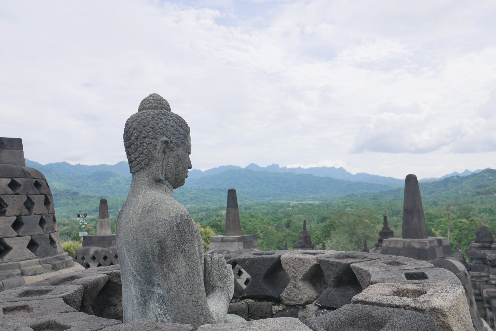
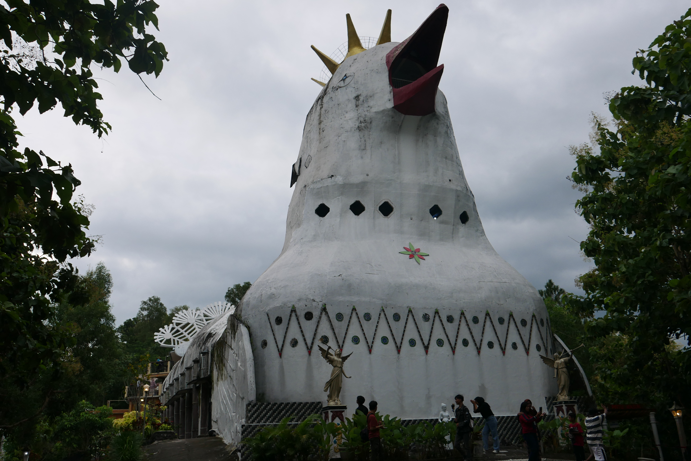
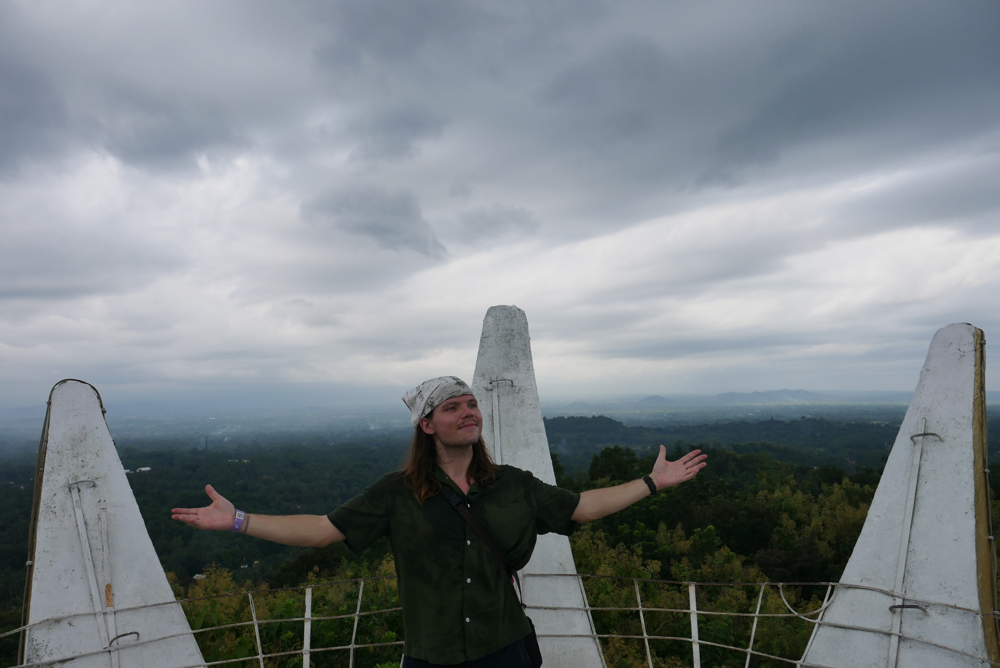
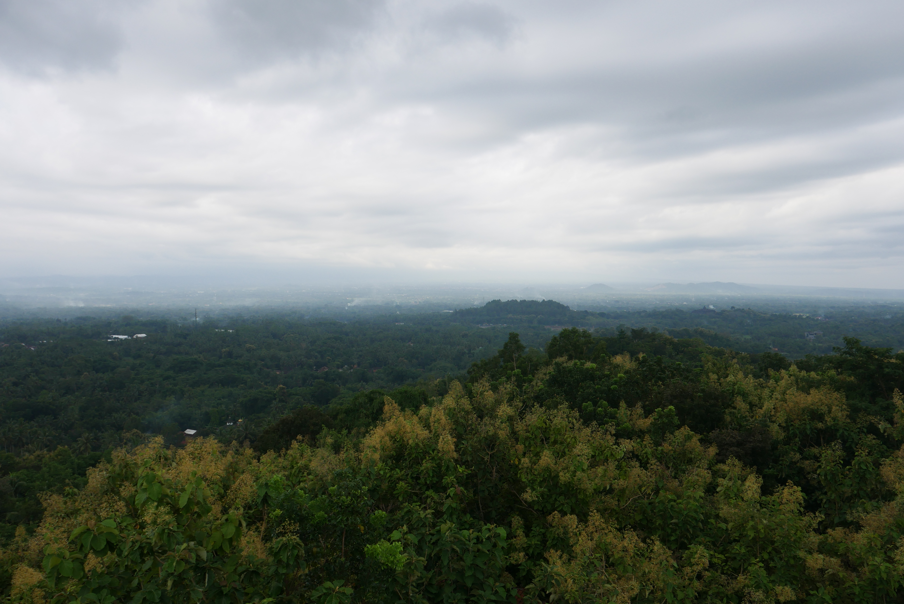
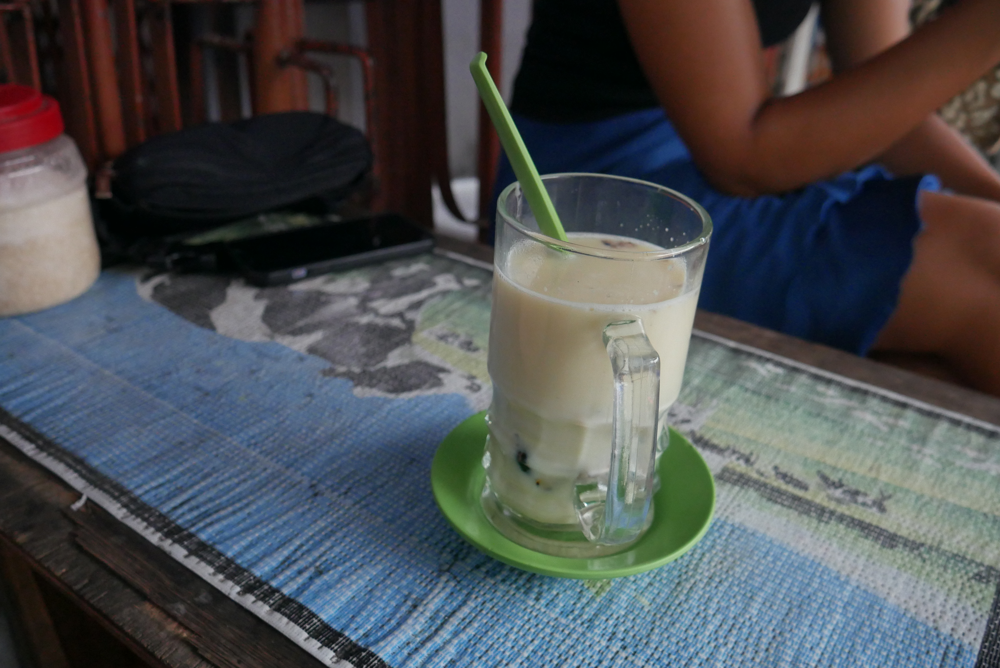
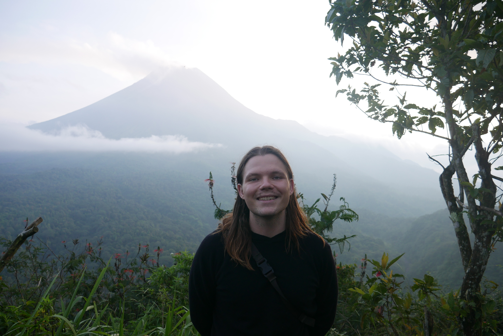
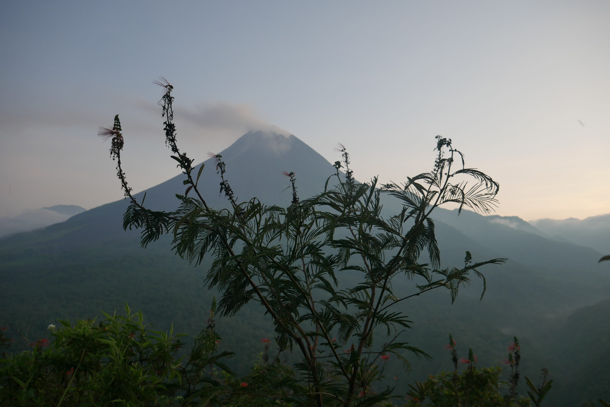
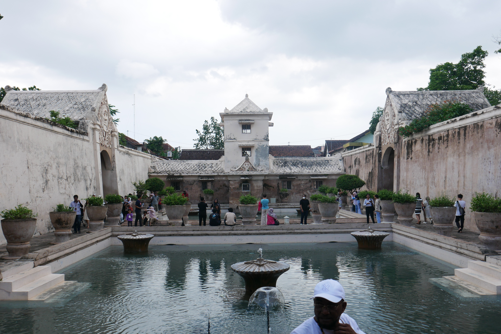
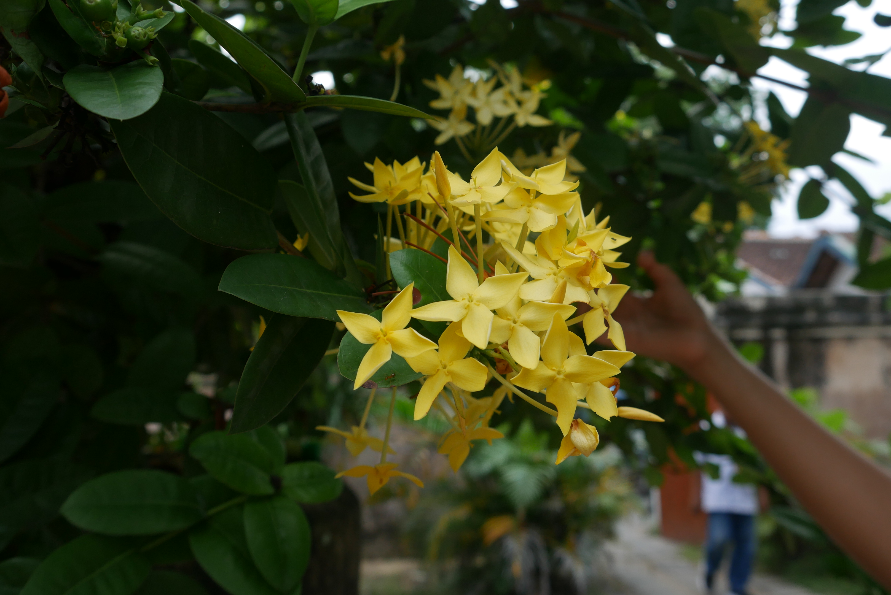

Grand architects of devotion **twice** built wonders of the world here, each over a thousand years ago, but only a hundred years apart. The first sprawled over an existing hill with each ascending level representing different realms of Buddhist belief. The second had 240 shrines lift their skinny spires like antenna to heaven, each housing key characters in Hinduism. Both reflected the waves of western influence that swept through Java in that time. Both constructions were returned to their environments, forgotten for a thousand years, then rediscovered by the British in a different period of Western influence in Java. However, neither marvel of antiquity bears much semblance to the Yogyakarta of today, other than being employment centers (90% of each temple’s workers are Muslim) and gravitational pulls of domestic and international tourists. The city today is more than two collections of ornate and pious piled stone, it is a proper city worthy of visiting independent of the flanking temples.
## Prambanan and Borobudur
Rooted an hour metro ride east of Yogyakarta’s center, Prambanan is the more accessible of the two major temples. All the guides and tours online recommend going in the early morning or late afternoon to avoid the sadism of the noon sun. This is how most tours run, sunrise at one temple then sunset at the other, with the delicate fleshy cargo shuttled between in large, air-conditioned vans during the punishing midday. Personally, I find deep discomfort with being herded about on an extracorporeal timer. I also find pleasantly meandering through my mornings to be extremely natural. This meant I embraced the challenge of Central Javanese dry season noon, without the masochistic intent. 
The day before Prambanan, I made a friend at my hostel. Her name was Alex. We met at the communal breakfast table. Between mouthfuls of green pandan rolled pancakes filled with sweet, caramelized coconut, we jumped past the pleasantries of “Where are you from?” and “Where have you been?” and slid through the investigative “What are you looking to do here?” directly into the collaborative “What are **we** going to do?”. For better or worse, I describe myself as peak go with the flow. This is why I always appreciate coming across people who *are* the flow.

Alex and I arrive to Prambanan around 10am. She asks me if it is **really** worth it to see this temple. It is $25 for a standard ticket at the major temples, certain discounts apply. There are loads of other non-major temples scattered across this massive and storied island with little to no cost. Alex is many months deep into an indefinite period of solo travel, so each dollar carries a little more value. This is my first solo trip, really more of a brief vacation during a school break. I assure her that it’s worth it and since we’re already here, wasting time with further deliberation is as costly as wasting money. We enter the ticket building, slide our long-expired student IDs across the counter, pay our way, and stroll out into a sprawling park with lovely speakered chimes, but no temple.
We stroll a few hundred meters through the perfectly monotonous lawn and under the shade of extensive white barked trees. I’m lulled into a pacificist saunter by the chimes, the recording just long enough to not notice the breaks or loops. The combination of the pedantically pleasant flora and audio makes me forget that I’m in Java. The park seems so foreign to the city outside the fence. Just before the saccharine contemplations start to hit, there is a break in the trees and Prambanan appears. 

Shooting out from the base of the temple complex across the park like a cemented frog tongue is a promenade medianed and shouldered with colorful shrubs. We follow the strip to the funneling gates. Lining the gates were about a dozen older men selling tour guide services. Being both cheap and studious, I already scoured the internet for all the info I possibly could’ve received from the guides. I do this everywhere I go, spending time to save money. This approach was firm until a woman in a local university approached me to offer a free tour as a part of her training. Why me? Maybe she saw my youthful joie-de-vivre and knew I would never contemplate complaining. Maybe she associated my high inseam with being a cool guy.

There was so much more information about the temple than I found online. Despite her reminding us that she wasn’t an expert, our guide explained all the stories behind the temple complex and shrines they housed in a way that left me more interested than when I started. This wasn’t just a pile of rocks, but a collection of stories that we lost and are slowly piecing back together. Prambanan is just one complex in this park. There are three others within an hour walk, each in varying states of rubble and repair. Hundreds of shrines, each with their own story of creation, reason, use, and restoration, intended to be immortalized in stone, have found a new life basking in the sun until their next geological nap.

A similar story can be written about the Buddhist temple of Borobudur, except that it is further from Yogyakarta and requires special slippers to be bought to enter. While both Borobudur and Prambanan’s walls are decorated with murals telling stories that I couldn’t understand, Borobudur had clear messaging incorporated into its design. The first few floors represent regular human life of desire and suffering through the Buddhist lens. Towards the top are gates protected by statues that remind people of the joys and pleasures in the normal world, and to make sure they understand the trade-offs of enlightenment and nirvana. The final few floors are scattered with upside down latticed cement lotus flowers housing meditating Buddha showing that meditation is the way up to the top. These top floors are where the views of the valley below are best appreciated. It is gorgeous to be up there, and a worthy place of worship. 
## A secret bird thing

Prambanan and Borobudur are certain locks for any visitor to have on their list when they come to Yogyakarta. Often, they are the only reason to visit. There are plenty of beautiful and active mosques within the city and lesser-known ancient temples on the outskirts, but my favorite was a lesser known (but no secret) structure deep in the jungle beyond Borobudur. Gereja Ayam, Bukit Rhema, Chicken Church; It is known by many names and known as many things to many people. Whether it is:

1-	A silly, miscreated, and naïve project (it is called chicken church despite the creator’s goals of making a white dove)

Or

2-	A rare piece of originality in the modern world that eagerly calls for peaceful understanding amongst all people

Is the choice of the viewer. I take the latter opinion. It took years of devotion stemming from a divine vision to create a place of worship for people from all backgrounds to create this building that was originally mocked, but later lauded. I respect the disregard of other’s insecure judgements in favor of personal conviction. The philosophical foundations of this place are as beautiful as the church itself. I consider it not only a must visit for anyone in the area, but also a raison-d’y aller. Even if the central conceits aren’t found to be appealing, it’s a freaking chicken church in the middle of the jungle. That was reason enough for me to go before knowing more about what it stands for. 

## The City
Before coming to Jogja, I had been in Timor for a year and a half (aside from a two-week medical evacuation to Bangkok which will make a wonderful article on its own someday). I was stoked to see somewhere else, especially a modern city to contrast the rural village I had gotten so used to. I found the cheapest option was to fly to Solo, a nearby satellite city with a decent rail connection to Jogja. A train? What a completely different world this would be compared to the crazy busses and minivans of Timor. I got out of the airport and start walking to the train station, and withing one minute out of the gates, a large family sees me, calls me over, and ask to take a picture shaking hands with their 10-year-old son. Maybe things weren’t too different from Timor. What I didn’t know coming into this trip was that it was Idul-Fitr, a major Indonesian holiday that involves heaps of travel of people from the cities to the countryside and vice versa. This family was clearly from the Kampung coming to Jogja to see the big city, not too different from myself. 

Near the central station was both my hostel for the next week and Malioboro, the domestically famous shopping and culture boulevard. During the part of my stay that coincided with Idul-Fitr, Malioboro was a dense, sweaty, overwhelming, endearing, and unending 3km stretch with countless parallel streets of hawkers, scammers, and an infinite amount of clothes. Every 50th step was met by a well-dressed middle-aged man asking me where I’m from, to which I’d answer the US, which universally was followed by “Obama! Indonesia!”. Fortunately, I was wise enough to dodge the eventual pitch to come see his student run Batik (traditional textile) workshop that would be closing in 20 minutes. Despite the scam, they were representative of everyone else I would meet on Java; extremely friendly, eager to chat, and pleasant (they were also the only form of hustler I’d see).  
On Malioboro, I noticed the two kinds of people who visit Jogja. One type of visitor ate mostly indoors with AC, the other ate from street vendors. One type of visitor would get around by ornate horsedrawn carriage or motorbike taxi, proudly elevated and displayed to all, the other sweatily hoofed afoot. One type of visitor took vertical selfies with the front camera of their phone, the other took horizontal photos of the area using the back camera of their phone and rarely including themselves. The first visitor is the domestic Indonesian tourist, part of the country’s emerging middle class, who are happy to flaunt their status; while the second is the western tourist who is desperate to achieve authenticity and shed markers of status or privilege. 

Owing to its position as a higher education capital of Indonesia, Jogja is brimming with young people striving to achieve, create, and enjoy life. My favorite highlight of the latter was Till Drop, a punky dive bar in central Jogja that featured live music, glass bottle beer, downstairs area hot boxed with ciggie smoke, and occasionally everyone arm in arm chanting some classic songs. My kind of place. This is perfectly paired with an abundance of wonderful food options late into the night and affordable food delivery for the over-Bintang’d. Jogja is famous for its Gudeg, a dish of jackfruit stewed in a lightly sweet, caramelized coconut sauce that is often paired with egg, tempeh, and kreprek (a spicy cow skin side). The best meal of the trip was a 2am delivered Gudeg that I devoured with my bare hands in an indulgent bliss.
## Merapi, the Palace, and the friends of the Palace
Mt. Merapi is the northern boundary of Jogja, and the ocean is the southern boundary. Equidistant to the two is the Sultan’s palace and all the fun things that correspond with extreme systematic intergenerational wealth inequality, like a carriage museum and water palace for the Sultan’s concubines. 

Merapi is an active volcano, and to climb it is prohibited. The next best choice is to find a local lesser peak, mount that in the wee hours, then shiver and fantasize about how warm it must be in the lava. The wee hours are recommended because in the darkness, the bright puss of lava is visible squirting out over the edges where it solidifies and causes a ruckus as it tumbles down the sides, providing fertilizer for the incredible lush jungle below. Regardless of whether the money shots are frequent or few and far between, it is well worth the long nap come dawn.

I split the taxi to Merapi with a group of girls from my hostel. Our driver told us he would wait until 7am for us, which is needed because there isn’t any internet that deep in the hills. That is not what happened. One of the girls gets a text from the driver saying he had to leave. No internet meant no booking a new cab and no translation tools to ask for help. Fortunately, in Timor-Leste enough Bahasa Indonesia is spoken (or unfortunately if you think about why) that I have been able to pick up a little here and there. Eventually we find a local family, and after playing with their kids, we manage to communicate that we’re looking to pay someone to take us back down to the city. This time, that is what happened.

Taman Sari is the aforementioned water palace deep in a residential neighborhood, near the Sultan’s palace, which would be difficult to find without knowing about it. It was designed by a Portuguese architect and built by who knows who, during the formative years of America’s founding fathers. Despite the hugeness of the Sultan’s palace, he needed more space to house his concubines and allow them to garden and make interesting elixirs. And I am glad he did, because the place is a unique contrast to the surrounding area, a mixture of Javanese and Portuguese styles that I’m sure would have been a lovely place to hang out with one’s concubines and sip potions together. The historical record at the palace doesn’t account how glad the concubines were about it. 

The Sultan’s was bland compared to everything else around it, an expansive emptiness with neat trimmings. The grand halls and plazas were once to demonstrate power and reserve, but now they just make convenient corridors for visitors. When going during the off-season, it felt more like wandering around a private middle school after hours. The horse-drawn carriage museum across the street was more interesting as at least it had cool things to look at. Better than both of those was the Javanese museum on the northern edge of the complex. I absolutely abhor them domestically, but my pro travel tip is to use dating apps when visiting new cities. At home, they’ve done loads of damage to romance, dating, and maybe society, but on the road, they are a nice way to meet locals who are eager to show off their city and meet new people. I went on a date to the Javanese museum with a lovely woman who put everything in much better context and showed me some decent places to eat afterwards. 
I had originally only allotted a few days to visit Jogja, but I enjoyed the city so much I extended to a full week; roughly half of my two weeks in Java. It is a well layered city, with displayed ancient history, lingerings of the recent past, and a youthful university population creating new versions of itself each day. 

