## You should go to Atauro

Atauro is one of my favorite places in the entire world; the village of Adara on the sparsely populated west side is probably #1. This post will briefly talk about my stories of going and staying there, but more so I hope it inspires you to go to Atauro or maybe to find your own Atauro wherever it may be.

### Where to go and what to do

In my view, the three best reasons to go to Atauro are dive on the east coast, hike Manucoco, and visit Adara, ranked in reverse order. Any tourist going to Timor-Leste will be told to go to the main places: Dili tais market, Ramelau, Jaco, and Atauro. The last of which is increasingly recognized for its abundance of corral reefs and marine biodiversity; I want to focus on Manucoco and Adara as I feel they are great experiences with substantially less online information.

### Adara via Beloi

Adara is a small village on the west coast of Atauro. In Adara is Mario's Place, a homestay where I have had some of my best memories of my life. To arrive, you have three real options: 

1 - Cheap ferry to Beloi, cross island by foot or boat to Adara

2 - Charter a flight to Beloi, cross island by foot or boat to Adara

3 - Charter a fisher boat directly to Adara

The third and second options are expensive, though the third is feasible if you have a group of friends with whom to split the cost. I recommend the first and crossing by foot, partly to save money and partly for the experience itself. The ferry runs a few times a week, get details from someone who would know once you plan to go. 

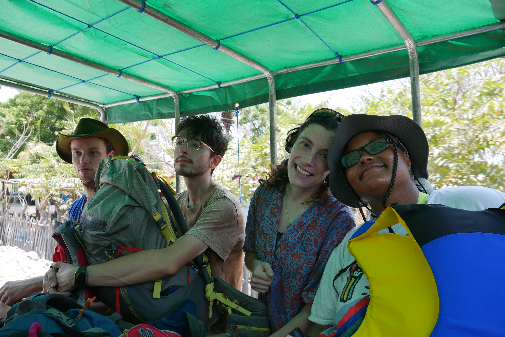 

In and near Beloi and plenty of options for accommodations. They're all great and worth spending time at. At any of these accommodations, ask about the path to Adara or Mario's place. It should be easy to find a map or an explained route across the island. Once you find your route, know that it will take about four hours to complete. There won't be many places for water and shade is limited on the beginning of the hike, plan accordingly. Also know that should you meet anyone on the path, they will likely know exactly where you are going before you say anything, they'll be happy to point you in the right direction. The trail is decently challenging, but is full of great views, plants, homesteads, and other interesting things that make it well worth the sweat. If you got his whatsapp number and coordinated with him, Mario may even have refreshments ready for you when you arrive to his place.

 
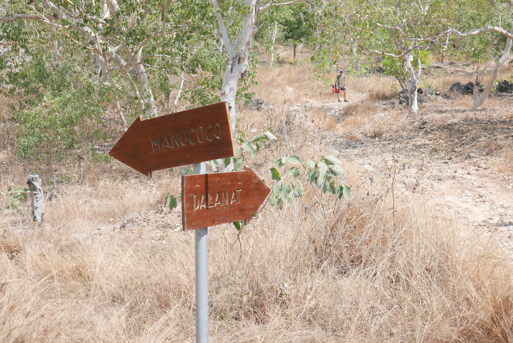 
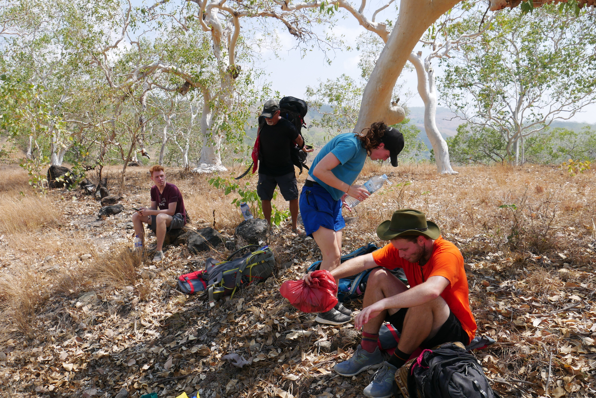
 

### Goat Trails with Shawn

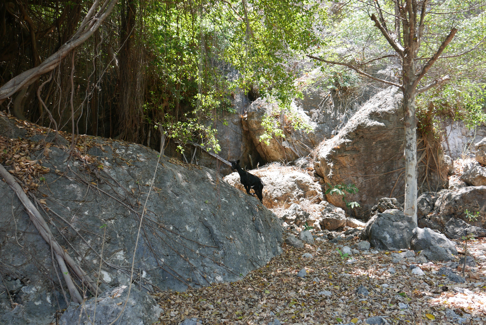

Atauro gets its name from the local word from goat. During the Indonesian occupation, it was called Pulau Kamping, Indonesian for Goat Island. You will see many goats on the island. While staying at Mario's place, I followed some of these goat paths with my friend Shawn. It started in curiosity, but ended in satisfaction and wonder.

 
 

We started in a ravine and started climbing to see where the trails lead. We climbed through thick brush, often passing seemingly paleolithic structures made of corals, presumably used to hold animals. Every ten minutes we reached a new plateau with new curiosities. Eventually we reached a great high plain with incredible views of the mountain, valley, and village below. We let curiosity guide us and it led us to somewhere exceptionally neat.

### Bungalows on the beach

To me, Mario's place in Adara is special because it is you, bungalows, beach, nature, no internet, fresh food, and barely anyone else. Food is included in Mario's price. The meals are usually rice, fresh vegetables, and fresh fish; it is simple fare, but the difference is the savor that's included only after hours of swimming, hiking, and playing. You will be hungry and you will appreciate every bite of your meals. Mario is also a cool dude who keeps pigs as pets. Some mornings you will wake up to see dolphins jumping in the water in front of you. Okay, admittedly, maybe most of my love of this place comes from who I spent it with each time I went, but I assure you the place is still magical no matter who you go with.

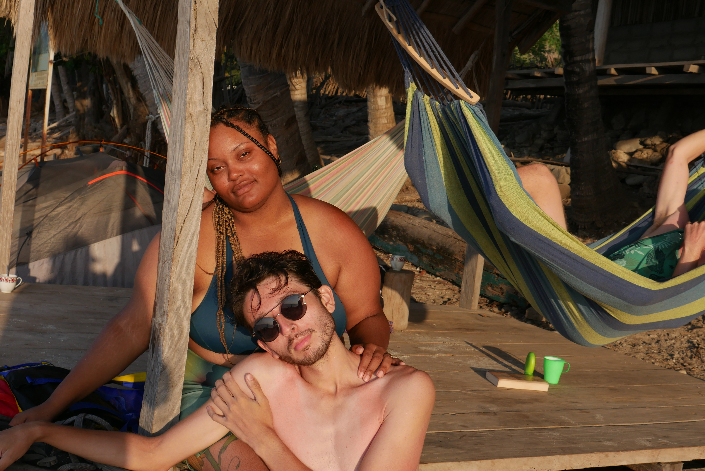

### Manucoco

Easy accessible to the ferry in Beloi is the town of Vila to the south. Vila has plenty of cool things to see and do such as the boneca co-op and beautiful religious sites. It is also the ideal place to start a hike to the top of the highest point on the island, Manucoco. At 1000 meters, it isn't that tall, but you really should ask around to hire a guide as otherwise I don't think you would be able to find the right trails. We stayed at a hostel named Manukoko Rek which connected the three of us with a guide for the next morning that charged $30. 

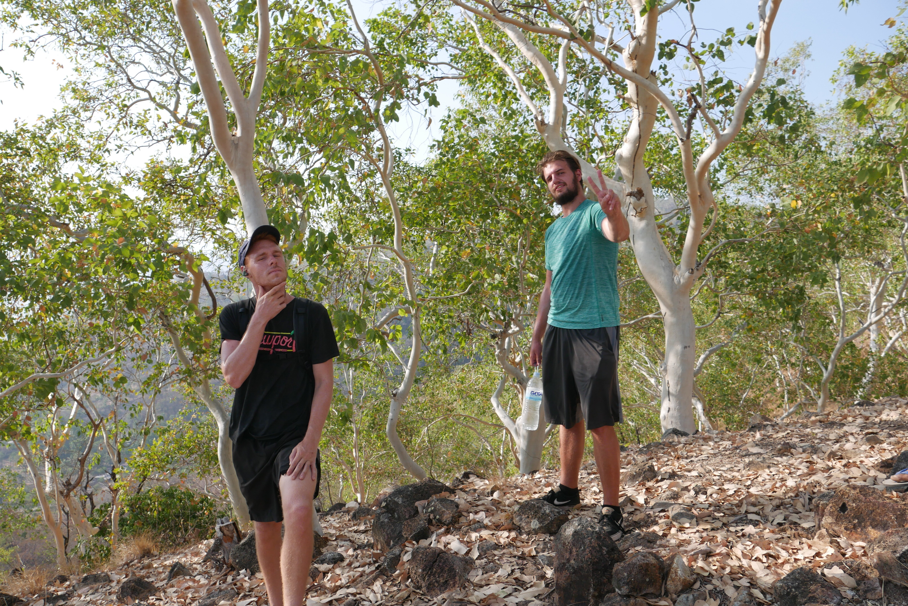 
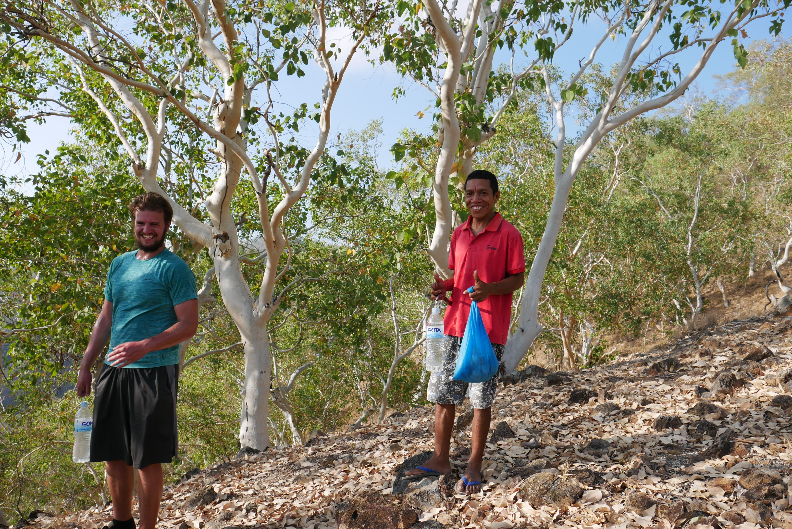

The trail has a few difficulties. Principally, it hardly exists. Our guide was actively cutting vegetation as we climbed; I'd suggest wearing pants. You'll also need to bring all the water and food for the hike, though our guide showed us how to identify and eat a local nut. 

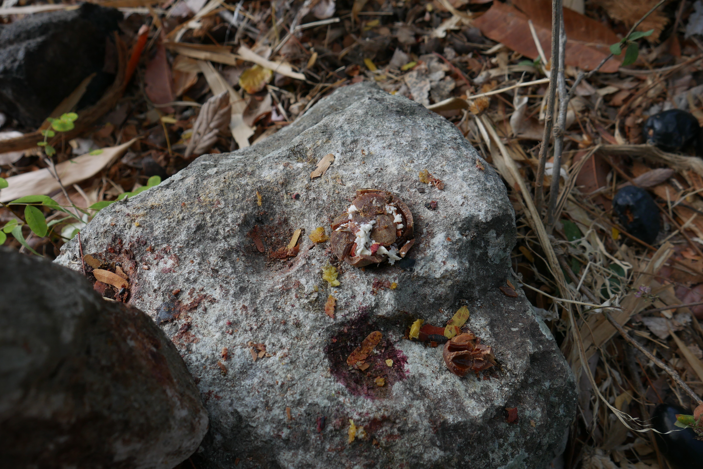 

The best part of this hike was the opportunity to go from sea to summit. As a result, you can see the gradual differences in flora as you ascend. One of the starkest differences was the difference in moisture. Since we went in dry season, everything was very brown and crunchy. However, at around 700 meters we entered a sudden lushness that felt completely different from where we came. I don't have any photos of under the lush foliage because these types of photos just look like a wall of green and don't allow for appreciation of the abundance we were in.

 

The very top offers a clearance of vegetation that allows great views of the rest of the island. Unfortunately, since it was late dry season we did not have good enough visibility to see the other nearby islands that would normally be visible. 

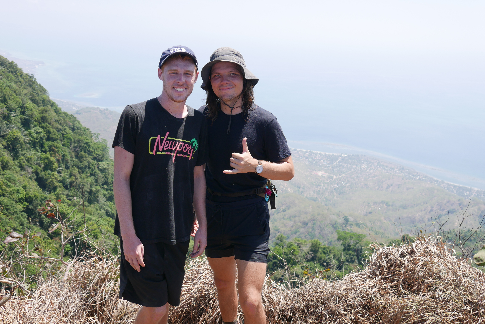 
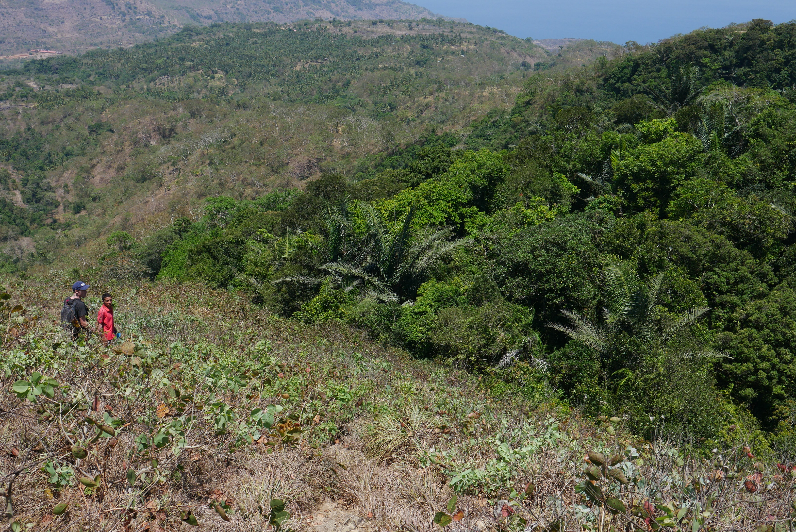

There are many islands, beaches, and mountains in the world. I have gone to many. Atauro is the one I fell most in love with. Partly because of its inherent and unique qualities, partly because of the friends I went with. I don't even have the photos from when I went with a group of Portuguese volunteers for a wonderful weekend of wine, dancing, and sun. I also never mentioned until now that before I first went to Atauro I accidentally poisoned myself eating still raw red beans. I often cooked for my host family and one night I cooked a red bean curry. I really wanted them to try it, but after three hours of cooking, the beans never got soft. They started eating their part of dinner, and I insisted they eat the hard beans that I spent hours cooking. They refused, because they clearly weren't ready. I ate a bunch anyway to show that it was good. I ended up getting terribly sick and bed-ridden for several days. This didn't stop me from getting on the boat to Atauro for a friend's trip. It was horrible. Out both ends on the boat. Saved by cup noodles. Stuck in bed for days while my friends had fun. Despite this brief turmoil, the memories of Atauro are still so fond in my mind. I love this place and I hope you can love it or something else as much as I do.

  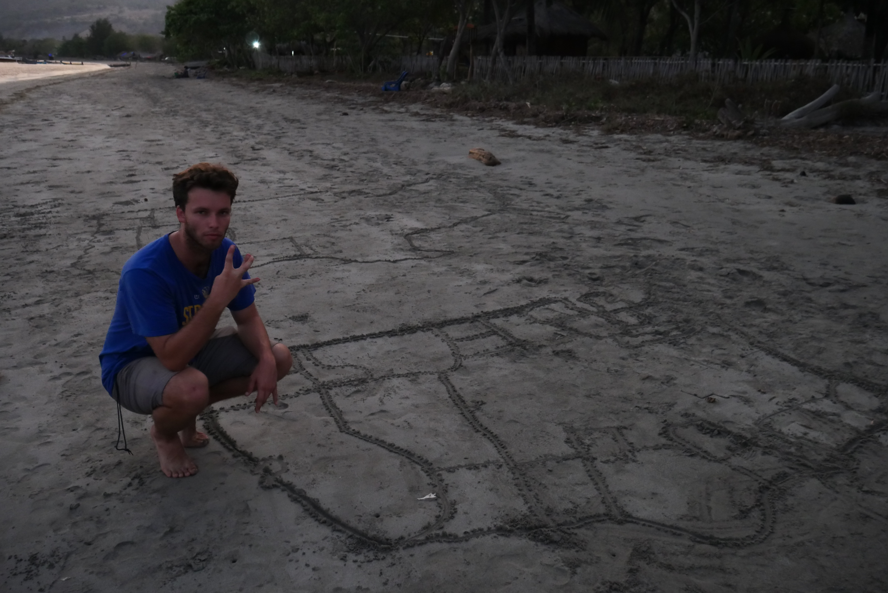 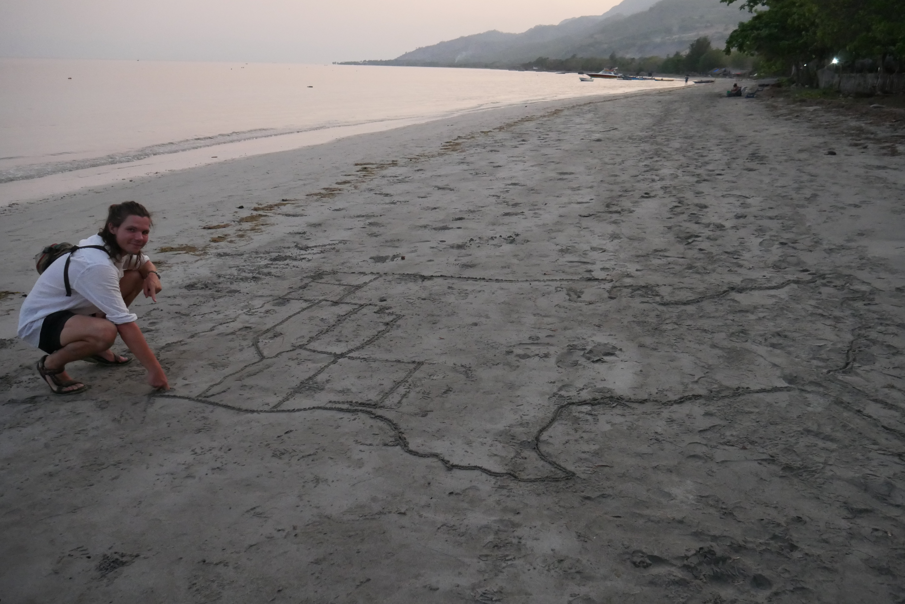