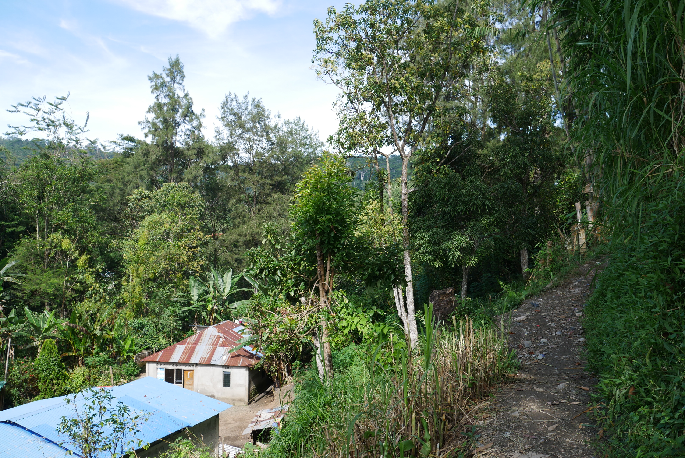
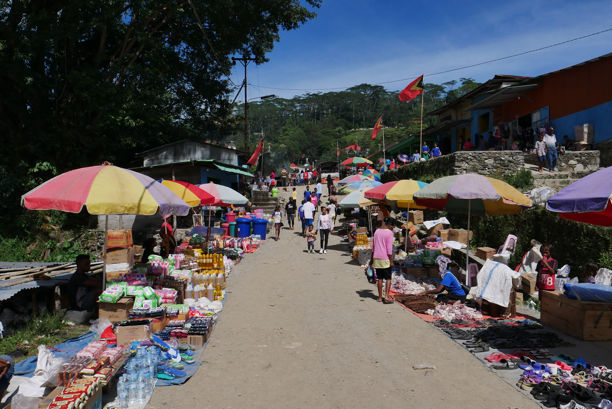
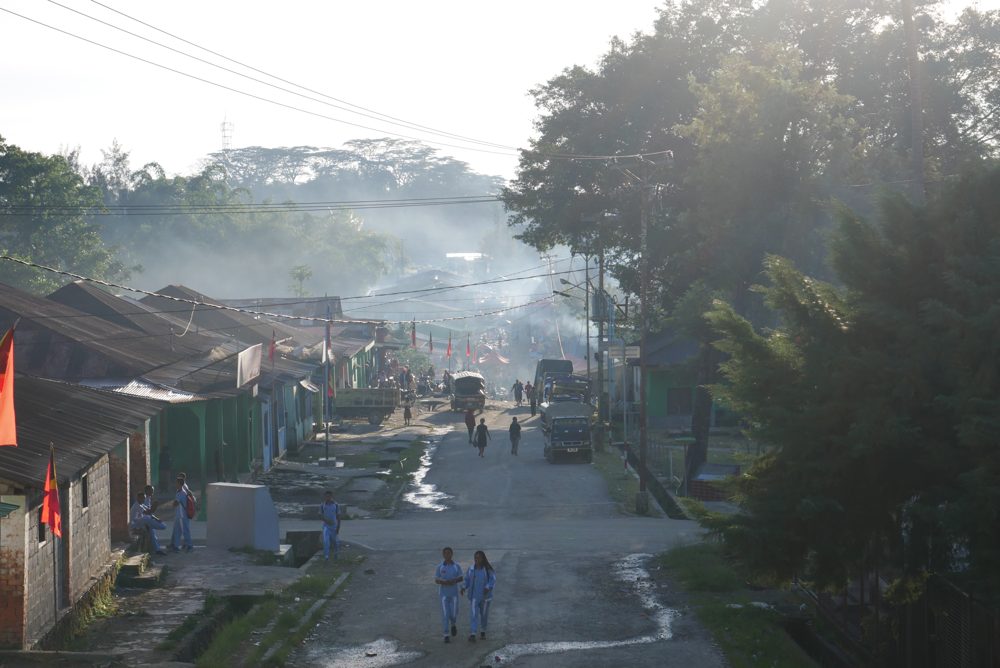
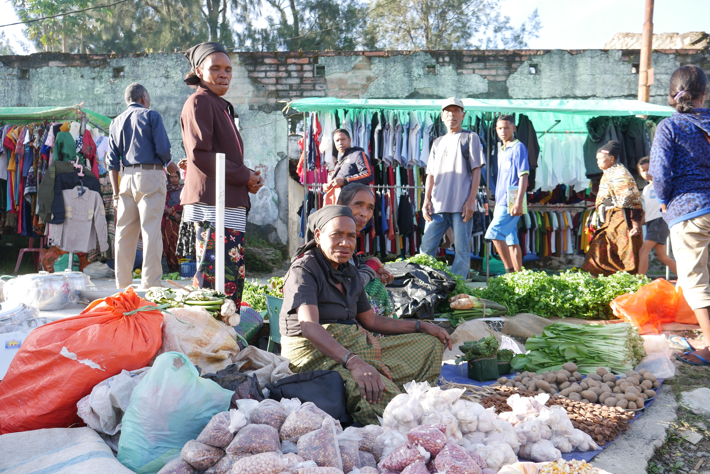
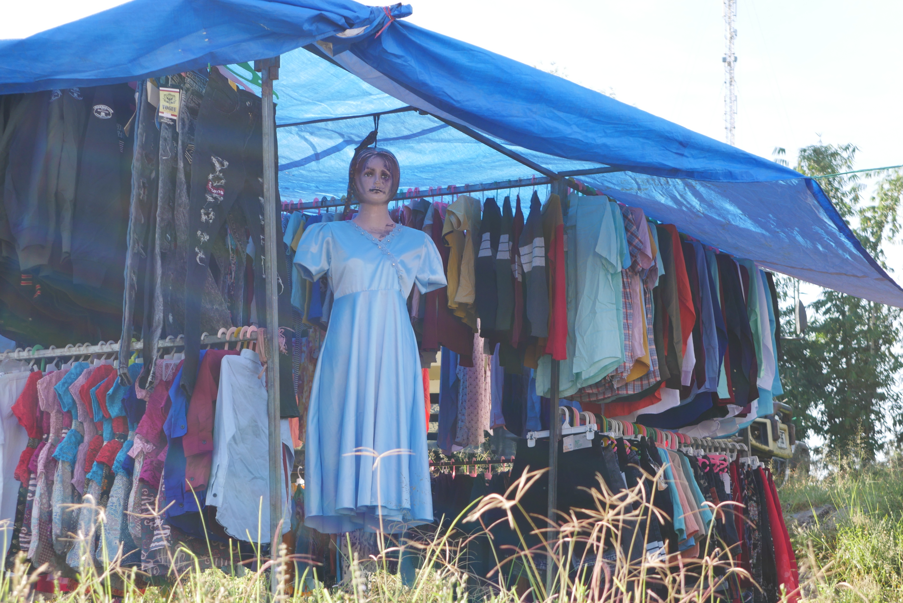
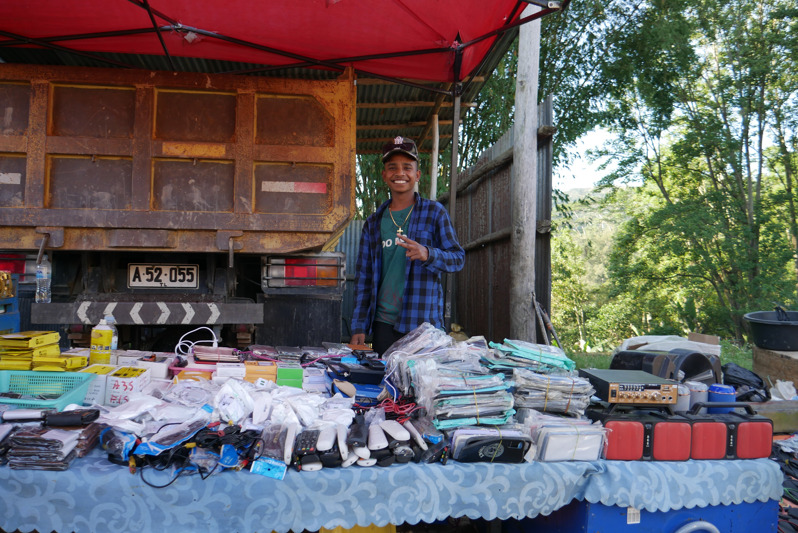
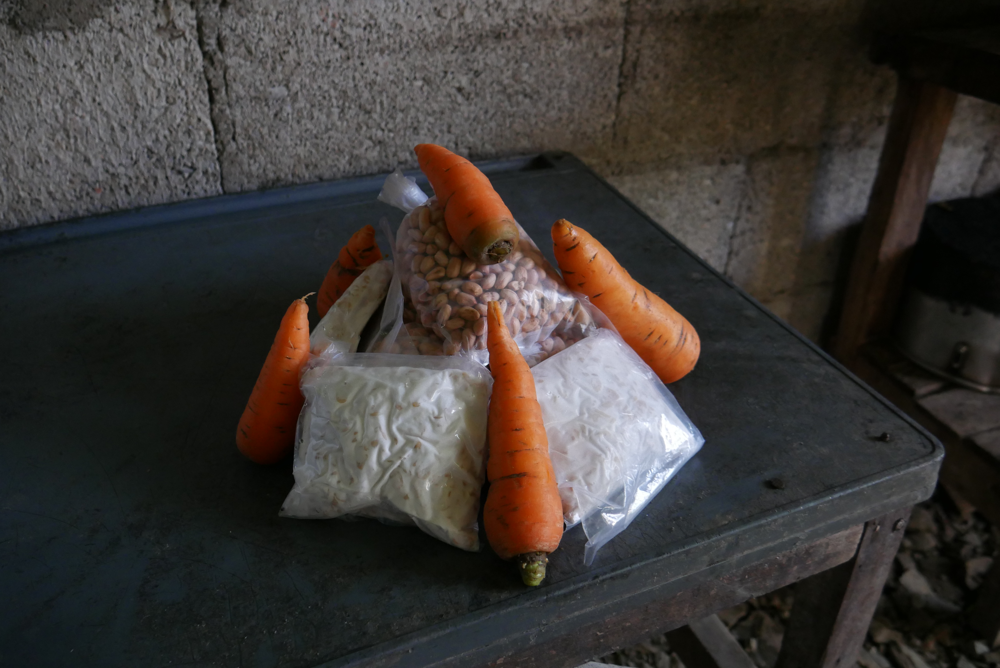
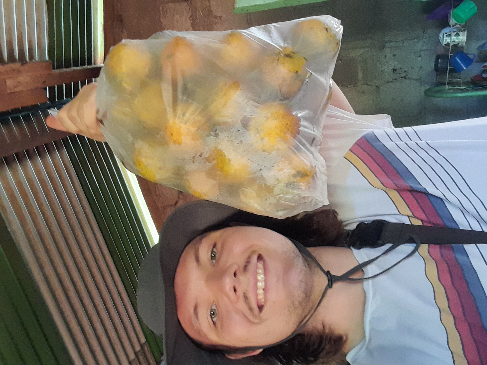
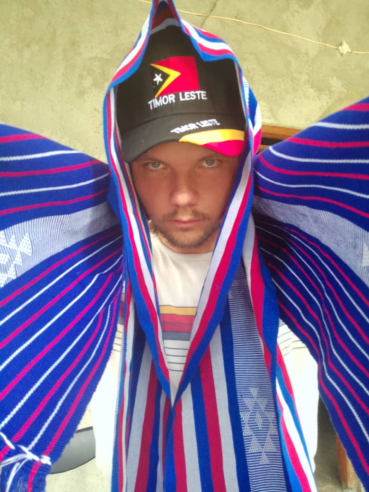

In Ermera Vila, the vestiges of its former role as municipal capital are readily visible. Today nearby Gleno is the capital of the municipality of Ermera, while Ermera Vila is just the head of the sub-district of Ermera [Though locally address are written differently, when I'd write my address in the American style I would write it as Ermera, Ermera, Ermera, Timor-Leste (Timor-Leste is itself a redundancy, translating to East-East)]. 

For Gleno to be the municipal capital makes sense; Gleno is in a flat plain where two rivers meet while Ermera Vila is more topographically challenged on a mountain side in the forest. The foundation of the economy is coffee. Ermera Vila grows it and Gleno is the hub that collects and processes all the coffee from the district to then send to the capital, Dili. Gleno has a large market with goods from around the district and Ermera Vila has a few shops that sell shelf stable items and maybe has a lady out selling her garden vegetables. Gleno is thriving and Ermera Vila is struggling.

To make things more difficult, when I first arrived in Ermera Vila, the bridge that connects it to Gleno and the rest of the country had collapsed; it wouldn't be rebuilt for many months later. In the meantime, only motorbikes could reach the village via small alternative paths. This made access to market items even more difficult. Despite the challenges, we still have our weekly market day. Every Friday morning, vendors come from all over the district to sell their (or a Chinese or Indonesian importer's) goods. Though most people grow fruit and vegetables at home, most land is dedicated to coffee trees; this meant that the market day was a lifeline to access fresh fruit and vegetables. 

Only a small amount of people live in the proper village of Ermera Vila, most live on homesteads scattered throughout the coffee forest; Fridays are their chance to go to town, see people, sell what they can, and buy all the things they can't grow on their farms. Friday is also a school day. When the weather is nice, most classes are cancelled as most the students and teachers check out the hoop-la going on in the market. 

Sometimes there is a man playing loud Indonesian EDM to gather attention his raffle or BINGO game. Telecom companies will use similar tactics, but will trade the guy for a girl in a short skirt. My host family digs through a very large pile of clothes, of course it is only the pile owned by our cousins. After a few hours, they'll go from their knees to their butts to chat with everyone. The smells of diesel, cigarette smoke, and burning plastic are pungent in the air. I just buy fruit, tofu, and tempeh. Since tofu and tempeh only arrive on market day, I buy as much as I can because by Monday the pungent smell of the bins of yet-to-be-sold tofu and tempeh will overpower the diesel, cigarettes, and burning plastic.

I love the market day. It is a chance for energy to come to my sleepy village. On market day I have found fruits that I will likely never have again. Twice a year, one man sells his sweet gray passionfruit that I always buy in bulk because it is my favorite fruit (see photo below). I have found bananas in many shapes, sizes, and colors with flavors like canteloupe, green apple, caramel, and even mezcal (I swear). I love market day because of the seemingly random and absurd clothes that are sold. See the below photo of "Transgressive Sexualpraction". I once saw an old lady wearing a Death Grips x Ronald McDonald House t-shirt. There are countless absurdisms that I regret not buying.

I love market day in Ermera Vila. I can't wait for the next one.

