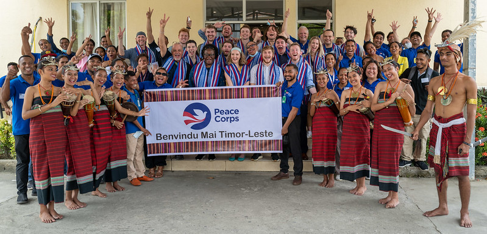
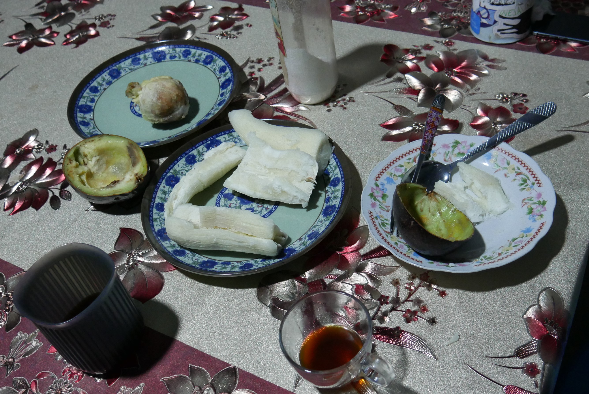
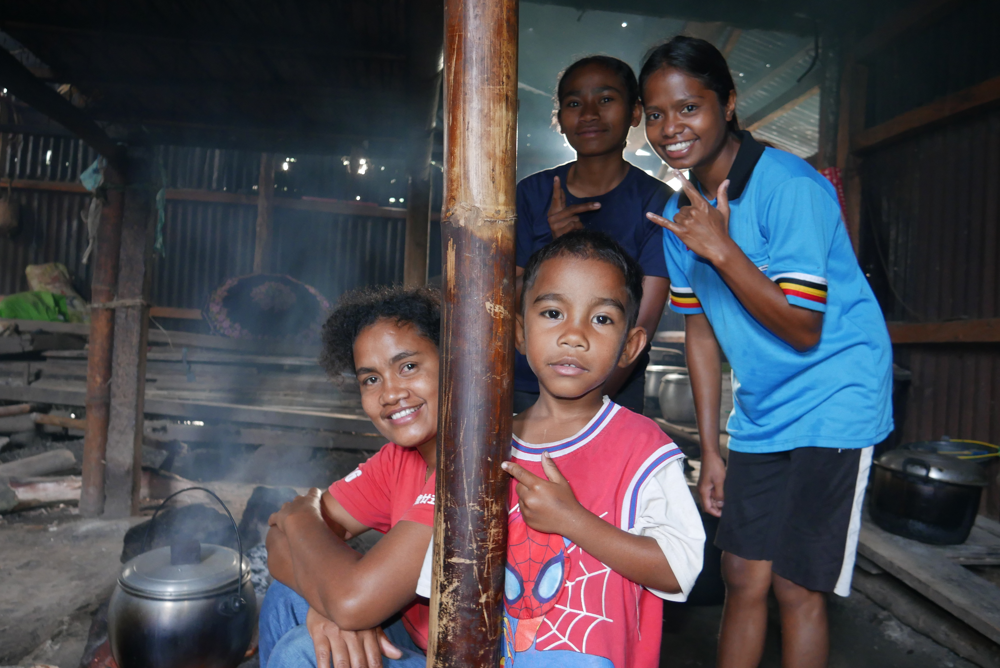
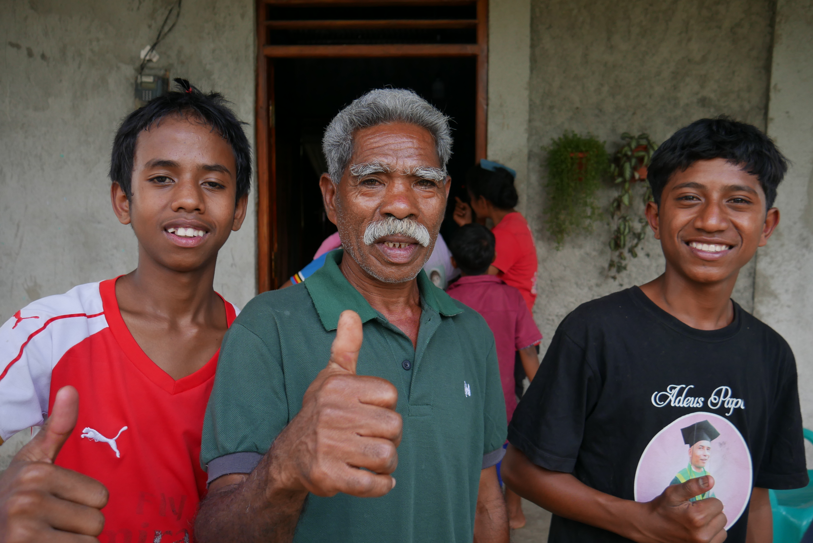

In January 2023, I joined about twenty other Americans in reopening the Peace Corps program in Timor-Leste that had been closed since the outbreak of Covid. When I was offered the honor to serve in the Peace Corps, I did not even know the name of the country to which I was about to commit two years of my life. When I boarded the plane, I had only just met the other volunteers the day before. This was a time of a great amount of change and growth, fortunately one that came with loads of memories and photos.

Once volunteers arrive in a country, Peace Corps trains them for three months. In Timor-Leste, the volunteers all live in the same village in this time, but each with their own local host family. Living with hosts confers numerous benefits, most important of which are cultural and linguistic assimilation. Living in the same village as twenty other mostly clueless debutante American volunteers confers different benefits, most importantly as a source of drinking buddies and shoulders to lean on and complain to. I appreciated the balance.

Peace Corps hires a mix of US citizens, host-country nationals, and third-country nationals to its staff. In the program for Timor-Leste, only a few positions are held by non-Timorese. This meant that during training, we were mostly taught by locals who were well equiped to teach us the national language (Tetun), important cultural behavior, and the realities of the contextes in which we would work. I had two language teachers in my training, Mana Vero and Mana Tita, both of whom I credit so much of my ability to learn the language and do well in the new culture. The rest of the learning came from my host family and all the neighbors with whom I talked and played everyday. I always joke with people that the best way to learn a language is to have it be the barrier between you and being able to eat.

Near the end of training, we were told of our homes for the next two years. It was an emotional ceremony as it meant both that we would start the real challenges of Peace Corps service, but also that we were bid a temporary farewell to each of us who had trained with each other in such a unique environment. Fortunately, the bonds formed in training kept us together through the rest of service, no matter how far we may have been (with some of us walking more than four hours one way through the jungle to see each other). I was given the site of Ermera Vila, which was close enough to the training village of Gleno to reach in just over an hour by car or foot. I would be the only volunteer in this village, but there would be a few volunteers in nearby Gleno to keep me company when I wanted. 

I actually had the opportunity to visit Ermera Vila the week before I found out it would be my new home. My training family host sister took me to visit her family in Ermera. I fell in love with the brisk mountain air, a needed respite from the punishing heat of the coast and capital. It also had the benefit of being close enough to the training village that I could frequently visit the friends I made during training.

Whether it was the adventures of Ruby and Mike's birthdays, the escapades of river crossing with a group of boys to find a cool statue, or the peace of veranda talks, those three months hold so many unforgettable experiences within a short and turbulent time; of course, the very best stories are kept between us and not on a blog read by my mother or the AI scraper of my future employer. Enough of the words, enjoy the photos.

